## Über mich

Seit Juni 2023 bin ich Selbstständig und begleite Kunden bei agilen Transformationen und biete mich als ad interim Scrum Master, agiler Coach an. Nebenbei versuche ich Kurse für Scrum Master zu designen, die sie in ihrer Maturität weiterbringen können.

Ich bin ein sportlicher Familienvater, Freizeitmusiker und Software Engineer.

Ich habe jahrelange Erfahrung in unterschiedlichen Softwareentwicklungen. Von 8-bit Mikroprozessoren bis zu Enterprise Applikationen. Ich arbeite als Scrum Master in verschiedenen Teams. Ich war über 10 Jahre bei der CSS Krankenversicherung AG als Scrum Master tätig und dort sehr aktiv in der Community. In meiner Rolle habe ich ganz unterschiedliche Teams begleitet und habe viele Erfahrungen sammeln dürfen. In dieser Zeit habe ich Initiativen zur Engineering Culture gestartet und in verschiedenen Self-Designing Teamworkshops mitgewirkt.

Ich glaube an Agilität und bin überzeugt damit die Arbeitswelt etwas besser machen zu können. Basis sind für mich eine professionelle Haltung, Pragmatismus, Vertrauen und Offenheit.

Der unten dargestellte Baum zeigt auf welchen Werten (braun) Agilistic aufbaut und nach welchen Prinzipien (gelb) und Praktiken (grün) gearbeitet wird. Es soll einen Eindruck zu Haltung aufzeigen und hat nicht den Anspruch auf Vollständigkeit.

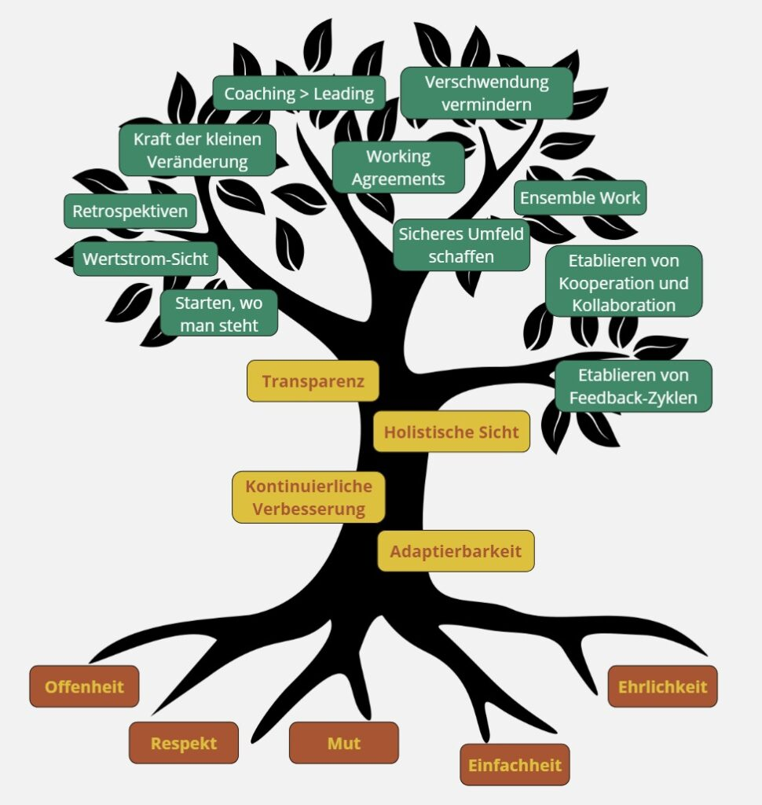

### Zertifikate

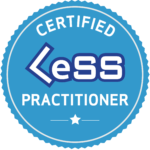

LeSS ist ein Skalierungs Framework für Scrum und dieses Zertifikat beinhaltet eine 3 tägige Schulung bei einem LeSS Trainer, das sehr viel Praxis Übungen beinhaltet und sehr auf das systemische Denken setzt.

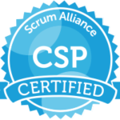

Certified Scrum Professional ist eine bzw. war eine 12 tägige Weiterbildung in Scrum. Ist in etwa mit eine Certified Advanced Studies vergleichbar. Man setzt sich intensiv mit Scrum und verschiedenen Rollen auseinander und lernt vieles über Softskills und Leadership.

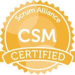

Grundausbildung als Scrum Master. 3 tägiger Kurs, indem man Scrum intensiv erlebt und lern.

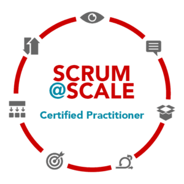

Scrum at Scale ist ein Denkmodell für skaliertes Scrum. Ich würde nicht sagen, dass es ein Rahmenwerk ist, sondern gibt einem mehr Information darüber, an was man sich halten soll, wenn man Scrum skalieren muss.

### Konferenzen

#### 2019

##### Conference Talk

Die Lean, Agile, Scrum Konferenz hat ihr 10-jähriges Jubiläum. Mit meinem Scrum Master Kollegen Martin Ineichen haben wir über einen Workshop gesprochen. In diesem Workshop haben wir mit 70 Menschen ein Reteaming gemacht.

<figure>

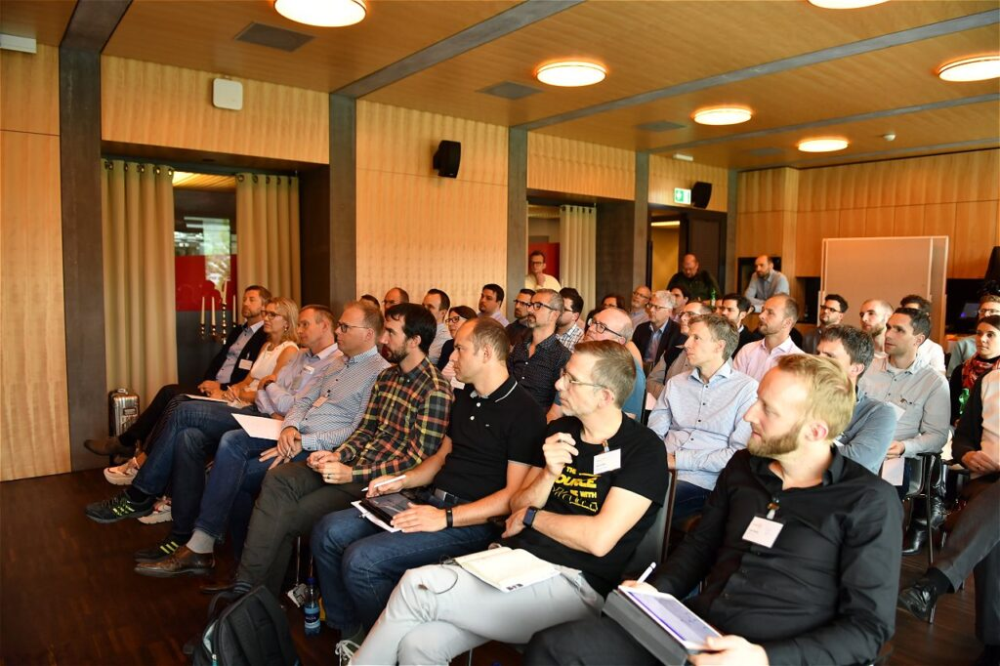

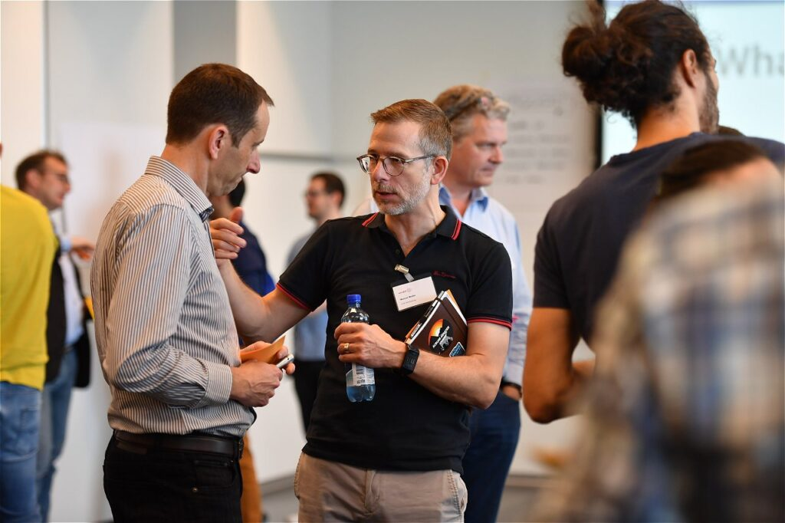

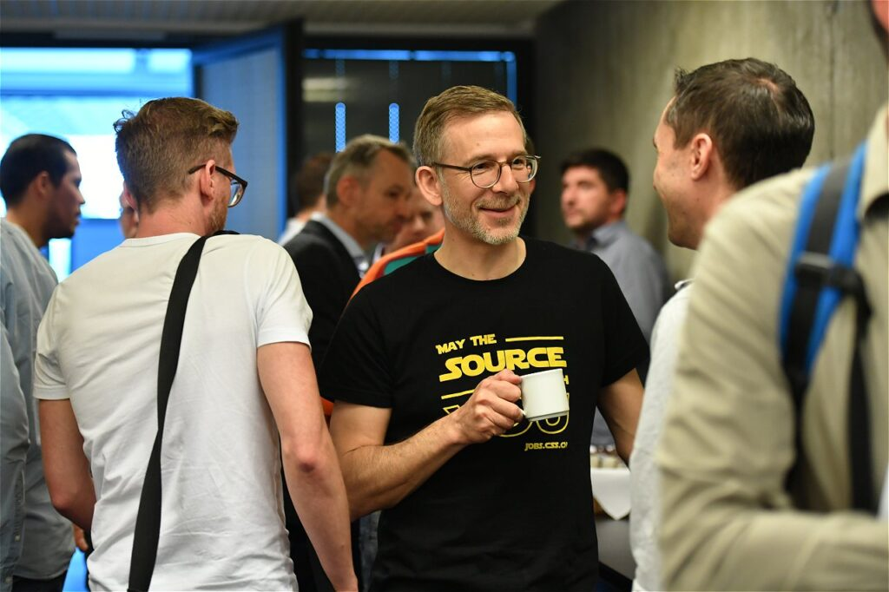

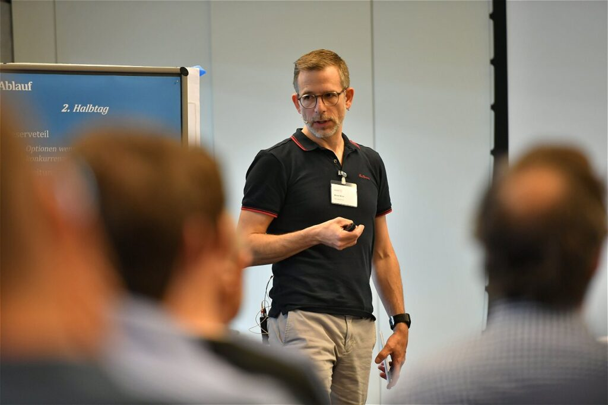

<figure>

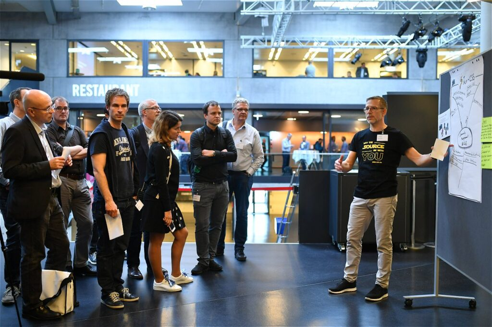

<figcaption>

Lightning Talk

</figcaption>

</figure>

</figure>

##### Lightning Talk

Mein erster Lighning Talk über die Community Manager bei der CSS Versicherung. Wir sind verantwortlich für das Management der Konferenzbesuche von 140 Personen, das Sponsoring-Management, die Community Work innerhalb und außerhalb unserer Organisation.

#### 2018

Mein erster Vortrag auf einer offiziellen Konferenz Lean, Agile, Scrum Konferenz 2018 über die Initiative zur Engineering Culture bei der CSS Versicherung.

<figure>

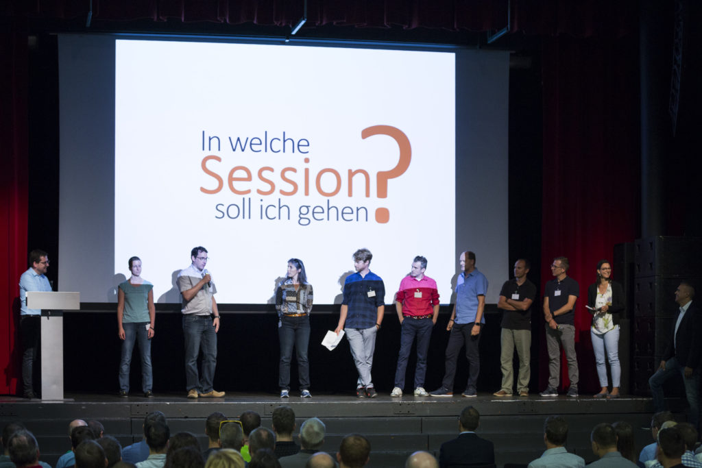

<figure>

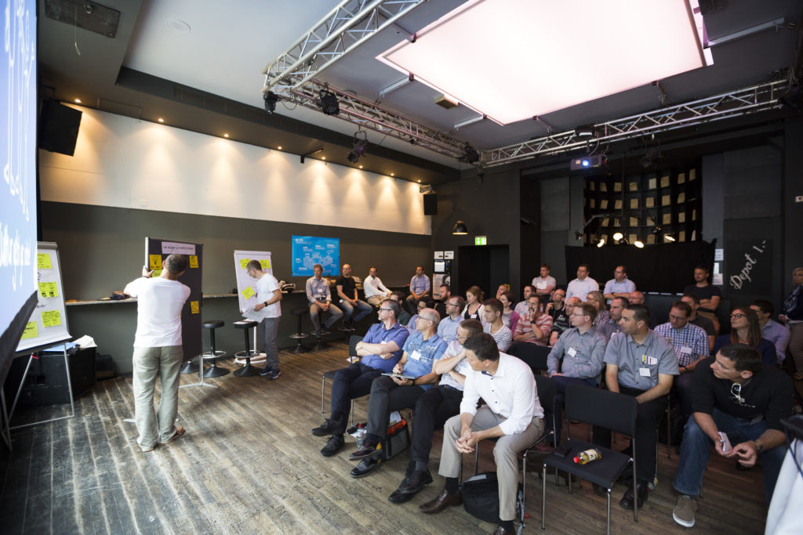

<figcaption>

Konferenz Vortrag

</figcaption>

</figure>

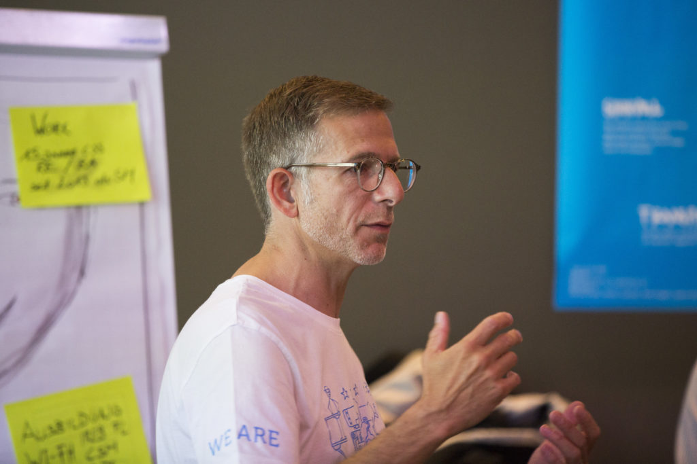

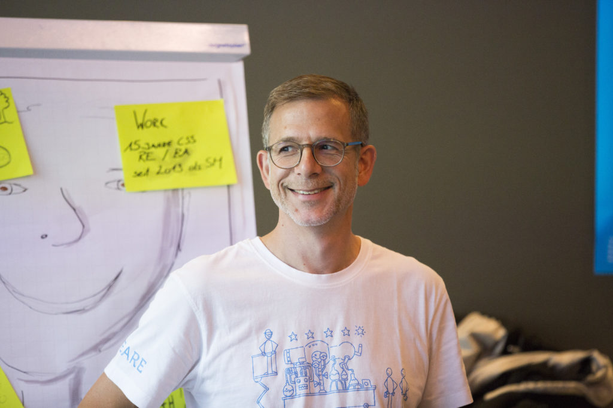

</figure>

#### Agile Breakfast

Als aktives Mitglied der [SwissICT](http://www.swissict.ch/) bin ich in einem Team von Moderatoren für die monatliche Durchführung von Community Events zuständig.

#### Community

Ich bin ein aktives Mitglied der Gemeinschaft in der agilen Familie in der Schweiz und lerne gerne von anderen.

### Job Interview Scrum Master

<iframe style="position: absolute; top: 0; left: 0; width: 100%; height: 100%;" src="https://www.whatchado.com/de/stories/embed/manuel-mueller-2" width="300" height="150" frameborder="0" scrolling="no" allowfullscreen="allowfullscreen"></iframe>

### Interview at Lean, Agile, Scrum Conference 2018 (Swiss German)

https://www.youtube.com/watch?v=qDS4xwAOSZ8&list=PLocHOjAjc9EZHuLvGvxqhFKzQ4-A1C5cD
