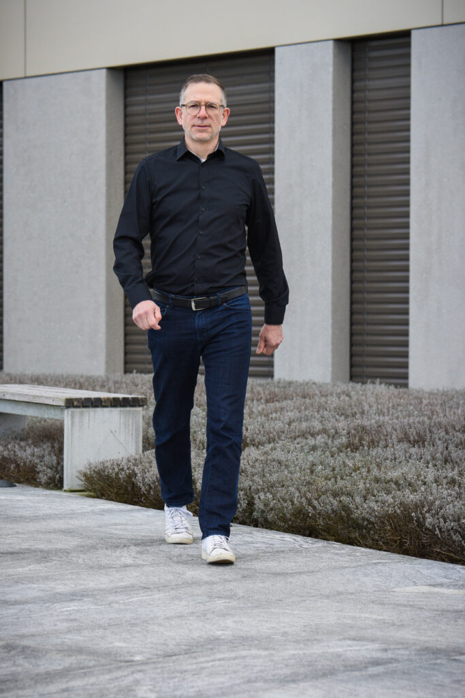
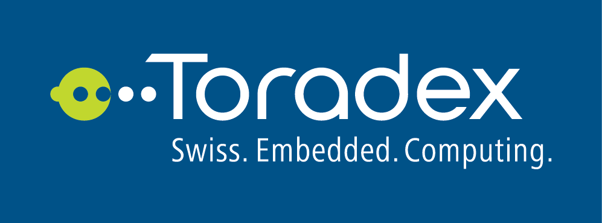

<figure>

<figcaption>

Manuel Müller

</figcaption>

</figure>

Agilistic hilft dir bei der agilen Entwicklung von [Menschen](https://www.agilistic.ch/menschen/), [Teams](https://www.agilistic.ch/teams/) oder [Unternehmen](https://www.agilistic.ch/organisationen/).

Profitiere von meiner [Erfahrung als Scrum Master](https://www.agilistic.ch/manuel-mueller/) und Agiler Coach. Bringe neue Inspiration in deine Unternehmung, zu deinen Teams oder zu deinen Mitarbeitern.

Als ehemaliger Softwareentwickler kann ich technische Teams coachen und entwickeln. Ich habe Erfahrungen mit Führungsteams und fachlichen Teams.

Ich bin unabhängig von Frameworks und bin sehr praktisch und pragmatisch. Primär geht es darum Wert zu schaffen und so wenig Ressourcen und Zeit wie möglich zu verschwenden.

Als Designer und Moderator deiner Workshops kann ich deine Teams und Organisationen mit einem ungetrübten Blick versehen.

* * *

## Was Kunden sagen

_“Manuel gewinnt mit seiner ruhigen und charmanten Art Menschen schnell für sich und treibt mit deren Unterstützung die Organisationsentwicklung voran. Mit subtilen Änderungen veränderte er die Haltung der betroffenen Meschnen auf eine positive Weise. Dies macht den Change sehr effektiv. Manuel packt an und übernimmt Aufgaben auch ausserhalb seiner Kernkompetenz und treibt diese zu guten Resultaten professionell voran._

_Stefan Frank, Group Lead R&D”_

* * *

_«Manuel stand mir als Agile Coach zur Seite, als ich ein agiles Setup in einem Infrastrukturprojekt eines Kunden eingeführt habe. Da das Projekt in einem Betriebsumfeld umgesetzt wird, gibt es zahlreiche Herausforderungen. Zum Beispiel, wie man die Anforderungen aus Sicht des Kunden formuliert und wie man die unterschiedlichen Disziplinen zusammenbringt. Durch seine Erfahrung konnten Manuel und ich gemeinsam ein für das Team und Kunden gutes Setup starten. Danke für die konstruktive und sehr gute Zusammenarbeit._

_Claudio Berchtold, Senjor Infrastruktur Projektleiter für den Kunden ISC-EJPD / fedpol»_

* * *

# Einblicke in meine Denkweise kann man aus folgenden Quellen gewinnen.

<iframe style="border-radius:12px" src="https://open.spotify.com/embed/episode/1TnrgkBuJpbrZhmEno7QHz?utm_source=generator" width="100%" height="352" frameborder="0" allowfullscreen allow="autoplay; clipboard-write; encrypted-media; fullscreen; picture-in-picture" loading="lazy"></iframe>

https://www.youtube.com/watch?v=Ms-NWHi\_JUI
