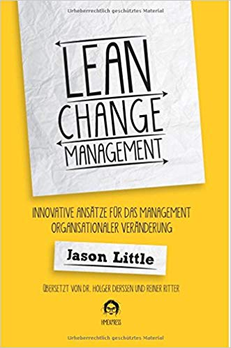
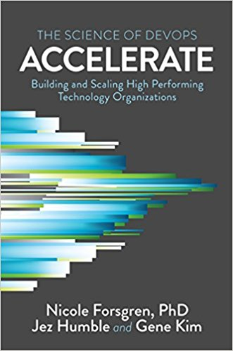
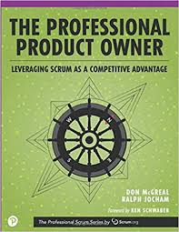
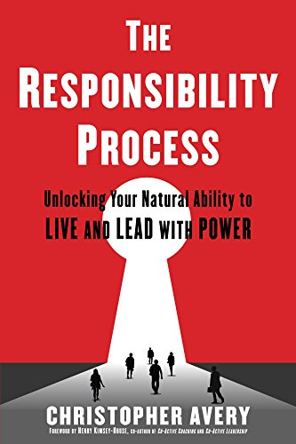
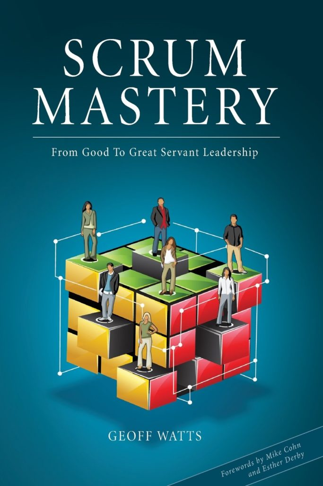
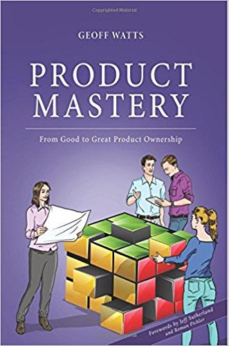

Here you gonna find some books I read with a short review from me.

Small and digestible book about change management. Much thicker books have been written about it. But the book keeps the Lean promise.

Jason Little goes through the change management topic on the basis of an example from the practice of an insurance company.

In particular, Lean Change Management is about generating insights, gaining options from them and starting experiments with these options. For experiments one should pay attention to determine the measurement parameters (hypotheses) before starting the experiment in order to be able to make an evaluation afterwards.

What remains particularly hanging over me is that for a successful change, an urgency must be created so that the people affected can accept the change. I personally believe that this is where the power of all change management lies, if you can give it meaning.

Great book, a must for changers.

  
Many books are written about software development. Many of them are very dependent on the Author, whether you believe the written or not. Often, one's own gut feeling is also involved or just a matter of faith.  
Accelerate takes a different approach. The book deposits theses with statistical facts on scientific basis. The book has therefore a high value and there is a good chance with the Approaches and solutions in achieving success as an organization.  
During the research for this book 23'000 survey answers were evaluated, which were received from over 2'000 companies worldwide. The size of the companies was from 5 to over 10'000 Employees. Companies ranging from start-ups to highly regulated industries such as finance or Healthcare.**Click** [**here**](https://www.agilistic.ch/index.php/accelerate/) **for more details..**.

Review comming soon...

Review comming soon...

Review comming soon...

Review comming soon...
