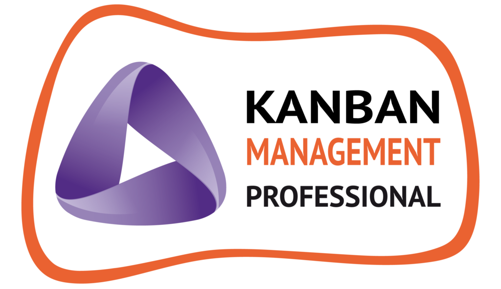
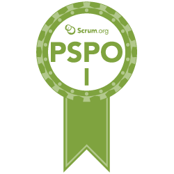
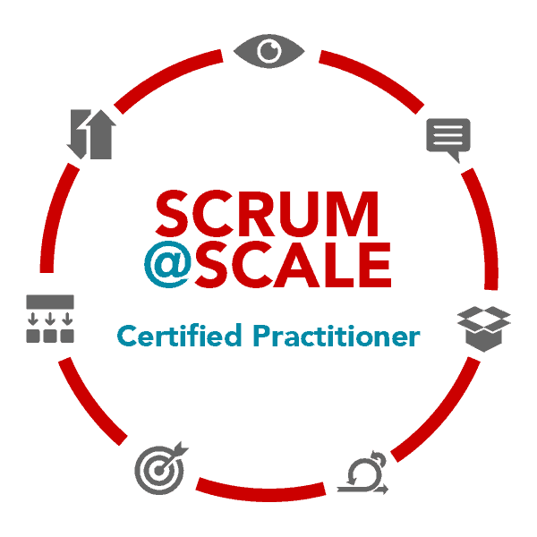
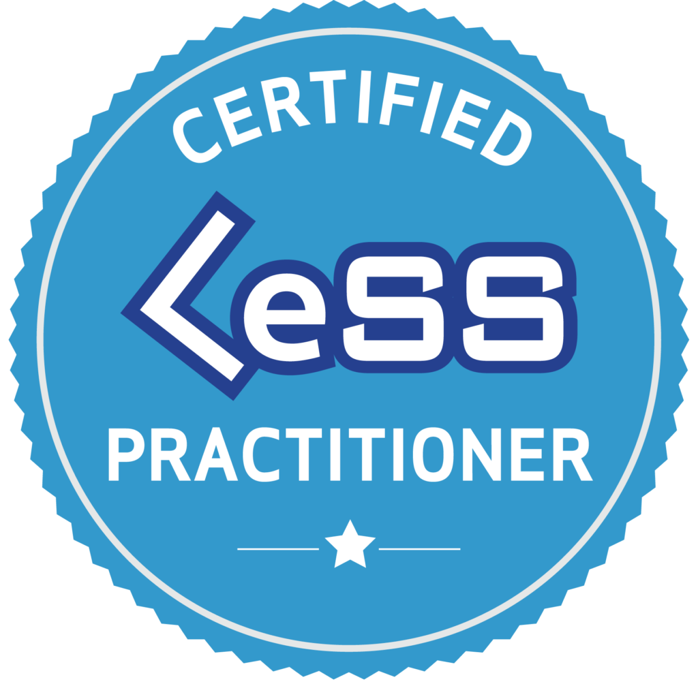
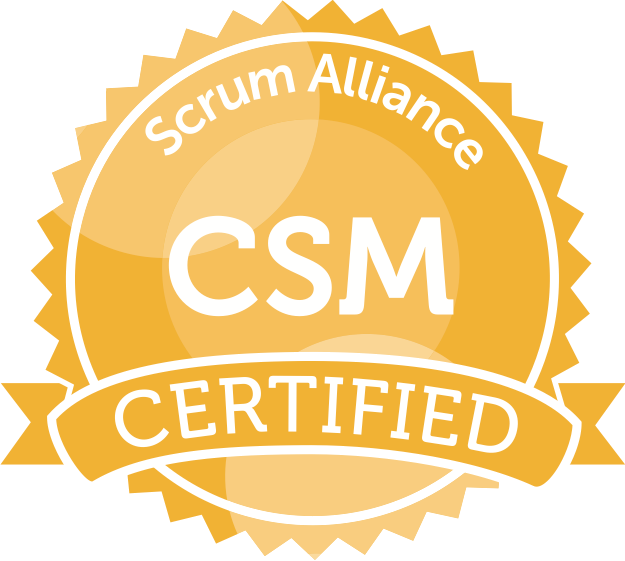
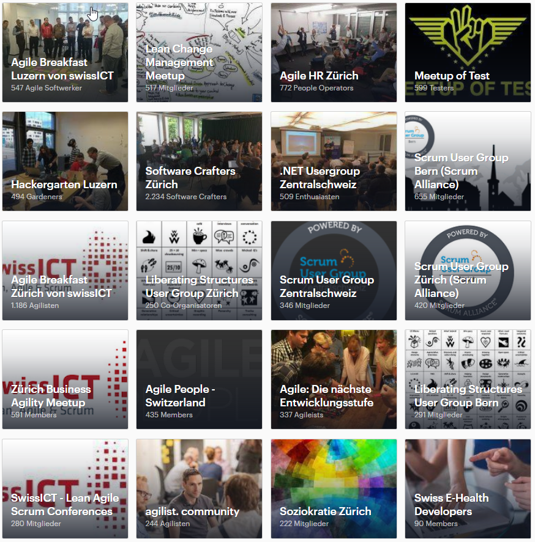
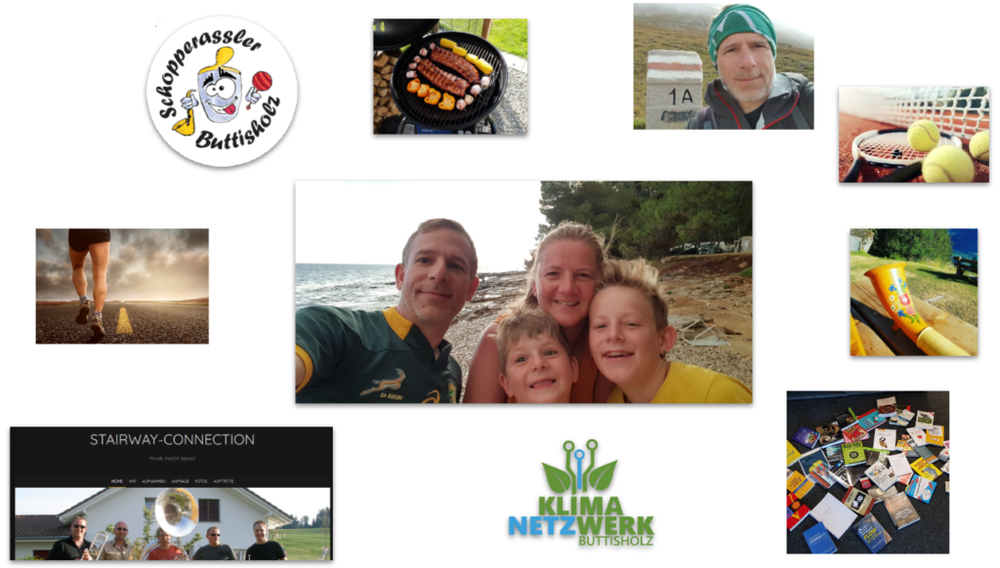

**Bestens vernetzter agiler Handwerker mit ausgesprochener Teamfähigkeit, Kundenorientierung und Erfahrung in Softwareentwicklung.**

* * *

| **[Beruf](#CVBeruf)** | [**Ausbildung**](#CVAusbildung) | **[Weiterbildung](#CVWeiterbildung)** | **[Community](#CVCommunity)** | [**Hobby**](#CVHobby) | [**Special Effects**](#CVSpecialEffects) |
| --- | --- | --- | --- | --- | --- |

* * *

# **[Beruflicher Werdegang](#CVBackToNavigate)**

## **01/2021 - heute | Agilistic**

- Teilselbstständig im Bereich Agile Coaching

## **11/2013 - heute | CSS Versicherung AG**

### 10/2020 | Interner Wechsel zu Stream Leistungen

- Nach über 6 Jahren im gleichen fachlichen Bereich mit ähnlichen Teams stand für mich ein Wechsel in ein anderes Gebiet an

- Neue Herausforderungen mit neuen Teams und neuer Fachlichkeit

- Aufgrund des Wechsels wurde auch ein Zwischenzeugnis erstellt

[CSS\_Zwischenzeugnis\_2020](https://www.agilistic.ch/wp-content/uploads/2020/12/CSS_Zwischenzeugnis_2020.pdf)[Herunterladen](https://www.agilistic.ch/wp-content/uploads/2020/12/CSS_Zwischenzeugnis_2020.pdf)

### 06/2020 | [Konferenz LAS: Einmal LeSS und zurück](https://lean-agile-scrum.ch/de/Home)

Ausgelöst durch ein Redesign der Organisation haben wir im November 2018 im Bereich Vertrieb vier Scrum-Teams gebildet. Gemeinsam suchten wir eine Skalierungsform für gute Wertschöpfung und entschieden uns für Feature-Teams im Sinne von LeSS. Wir befanden unser Design als gut genug zum Starten und gingen auf die Reise. Während anderthalb Jahren versuchten wir, den Prozess um die Teams zu optimieren. Im Juni 2020 gingen wir zurück zu Komponenten-Teams.

Warum? Das erzählen wir dir gerne in unserem Referat.

### 05/2019 | Konferenz LAS: 70 Beteiligte zu Betroffenen machen

- Konferenz Talk über unsere Reorganisation mittels Self Designing Team Workshop

- Organisation des Workshop

- Koordination des Change Teams

<figure>

https://youtu.be/5dRzP5yldkw

<figcaption>

Aufzeichnung des Talks an der LAS 2019

</figcaption>

</figure>

### 10/2018 - heute | Scrum Master im skalierten Umfeld

- Aufstellung der Scrum Teams nach Streams

- Professionalisierung der Scrum Master (100%)

- 2-3 Scrum Teams zur Betreuung

- Herausforderung ist das schneiden der Teams und die Zusammenarbeit über Teamgrenzen hinweg

### 06/2018 | Konferenz LAS: WE ARE - Ohne Kultur geht gar nichts

- Erster Auftritt an einer Konferenz

- Über 40 Teilnehmer an unserem Talk

- Talk über die Entstehung und die Resultate unserer WE ARE Initiative

### 05/2018 - 10/2020| Community Manager

- Managen aller Konferenzbesuche in der Software Entwicklung

- Organisation interne Entwickler-Konferenz

- Ausarbeiten eines Sponsoring Konzepts für die Software Entwicklung

- Organisation von Konferenz Auftritten

- Ansprechpersonen für Community Arbeit

- Zusammenarbeit mit HR für das Employer Branding

### 11/2017 - heute | Scrum Day Trainer

- Trainer für interne 1-tägige Scrum Kurse

- Interaktives Kennenlernen von Scrum

- Modul zur Selbstorganisation

- Teilnehmer aus verschiedenen Bereichen des Unternehmens

### 04/2017 - 10/2018 | Scrum Master

- Zwei Teams im Bereich Versicherungsabschluss haben wir zusammengelegt

- Grosser Technologiestack war eine Herausforderung

- Unterschiedliche Teamkulturen trafen aufeinander

- Grosses Team

### 10/2016 - 01/2018 | WE ARE

Von mir initiierte Bottom Up Initiative, bei der wir in einem Kernteam die Engineering Kultur aufgearbeitet haben und eine gemeinsame Sicht darauf produziert haben. Wir wollten damit die Leute bewegen und Werte und Prinzipien stärken.

<figure>

https://youtu.be/9WwWrcJiYlo

<figcaption>

Resultat der WE ARE Initiative

</figcaption>

</figure>

### 10/2016 - 03/2017 | Scrum Master

- Scrum Master von zwei interdisziplinären Teams im Vertrieb

- Grosse Herausforderung zwei Teams gleichzeitig zu begleiten

- Sehr unterschiedliche Kulturen in den Teams 

### 04/2014 - 11/2016 | Scrum Master

- Erste Anstellung als Scrum Master

- Enabling Team für neue Anwendung im Bereich Kundenservice

- Moderne Frontendarchitektur mit Anbindung an bestehendes Backend

- Erfolgreiches tolles Team

### 11/2013 - 04/2014 | Team Leader Java Backend Software Entwicklung

- Erste Anstellung als Führungskraft

- 12 köpfiges Java Backend Team mit sehr unterschiedlichen Maturitäten

[CSS\_Zwischenzeugnis\_2014](https://www.agilistic.ch/wp-content/uploads/2020/09/CSS_Zwischenzeugnis_2014.pdf)[Herunterladen](https://www.agilistic.ch/wp-content/uploads/2020/09/CSS_Zwischenzeugnis_2014.pdf)

## **04/2011 - 10/2013 Noser Engineering AG**

[Noser\_Zeugnis\_2013](https://www.agilistic.ch/wp-content/uploads/2020/09/Noser_Zeugnis_2013.pdf)[Herunterladen](https://www.agilistic.ch/wp-content/uploads/2020/09/Noser_Zeugnis_2013.pdf)

[Müller\_Manuel\_Noser\_Profil\_20130522.docx](https://www.agilistic.ch/wp-content/uploads/2020/09/Mueller_Manuel_Noser_Profil_20130522.docx.pdf)[Herunterladen](https://www.agilistic.ch/wp-content/uploads/2020/09/Mueller_Manuel_Noser_Profil_20130522.docx.pdf)

### 05/2012 - 10/2013 | IT Bestandesführung, Bereich Printing

Der Bereich Bestandesführung kümmert sich um die sichere Verwaltung von Vertragsdaten. Ein Teilbereich daraus ist Printing, welcher sich um das Aufbereiten unterschiedlicher Dokumente kümmert und dem Druck zur Verfügung stellt.

Aufbereiten von XML-Daten für den Druck von verschiedenen Dokumenten. Daten für diese Dokumente werden bei verschiedenen Business Services abgeholt und zusammengestellt.

### 04/2012 - 05/2012 | interne Weiterbildung JEE, EJB

### 01/2011 - 03/2012 | Peripherals Brandmeldeanlage, Siemens

Design, Implementation und Test auf embedded Hardware

## **11/2005 - 03/2011 | VZUG AG**

[VZUG\_Zeugnis\_2011\_03](https://www.agilistic.ch/wp-content/uploads/2020/09/VZUG_Zeugnis_2011_03.pdf)[Herunterladen](https://www.agilistic.ch/wp-content/uploads/2020/09/VZUG_Zeugnis_2011_03.pdf)

[VZUG\_Zwischenzeugnis\_2010](https://www.agilistic.ch/wp-content/uploads/2020/09/VZUG_Zwischenzeugnis_2010.pdf)[Herunterladen](https://www.agilistic.ch/wp-content/uploads/2020/09/VZUG_Zwischenzeugnis_2010.pdf)

### Software Entwicklungsingenieur

- Embedded Softwareentwicklung in C für Haushaltsgeräte bis zur Serienreife für 8-32bit Mikrocontroller

- Entwickeln und Unterhalten von Labor Software und Tools zur Erstellung von verschiedenen Daten für die Firmware in Excel VBA.

- Erarbeiten von Anforderungen, Konzepten und Algorithmen zusammen mit Anwendungstechnik, Hardware Entwicklern und anderen Software Ingenieuren.

## **07/2003 - 10/2005** | **KESO AG**

[KESO\_2005](https://www.agilistic.ch/wp-content/uploads/2020/09/KESO_2005.pdf)[Herunterladen](https://www.agilistic.ch/wp-content/uploads/2020/09/KESO_2005.pdf)

### Hardware Entwicklungsingenieur

- Know-How Transfer der Mechatronik Entwicklungsabteilung

- Weiterentwicklung bestehender Produkte

- Entwicklung von Elektronik Produkten im Sicherheitsbereich von den Marktanforderungen bis zum technischen Konzept

- Kleinere Softwaremodule entwickelt und bestehende verbessert.

## **01/2001 - 03/2003 | Assistent HSLU**

[HTA\_2001\_2003](https://www.agilistic.ch/wp-content/uploads/2020/09/HTA_2001_2003.pdf)[Herunterladen](https://www.agilistic.ch/wp-content/uploads/2020/09/HTA_2001_2003.pdf)

- Assistent für Mikrocomputertechnik

- Unterhalt und Führung des Mikrocomputertechnik-Labors

- Bearbeiten von Projekten im Rahmen des Fachbereichs

- Unterstützung des Professors im Unterricht (Entwicklungsumgebung Einführung, C-Einführung, Realtimebetriebsystem (FRT11))

* * *

# **[Ausbildung](#CVBackToNavigate)**

## **01/2009 - 06/2009 | HTA Luzern: Masterarbeit für MAS-ICT**

- Entwicklung einer Applikation zur Erfassung und Darstellung von Rezepten nach vorgegebenen XML-Schema

- Erfassen der Anforderungen des Kunden (VZUG AG)

- Einarbeitung und Verwendung der Rich Client Platform von Eclipse

- Einarbeitung in JFace/SWT inkl. Implementation für das GUI

- Deployment des Codes in fertige Applikation

## **02/2007 - 06/2009 | HTA Luzern: MAS in Informations- und Kommunikationstechnik**

[MAS\_ICT](https://www.agilistic.ch/wp-content/uploads/2020/09/MAS_ICT.pdf)[Herunterladen](https://www.agilistic.ch/wp-content/uploads/2020/09/MAS_ICT.pdf)

- Grundausbildung in JAVA

- Internet Technologien

- Datenbanksysteme Grundkenntnisse

- Software Entwurf und Design mit UML

- Software Architektur und Projektmanagement

- Computersysteme

- verschiedene Projekte

## **10/1999 - 11/2000 | HTA Luzern: Semester und Diplomarbeit**

### ISDN Identifikation Auswerter

- Einarbeitung in die ISDN Technologie und speziellen Protokoll Baustein

- Software Engineering

- Geräteentwicklung, Hardware

## **08/1997 - 12/2000 | HTA Luzern: Elektrotechnik, Vertiefung Nachrichtentechnik**

[Diplom\_FH](https://www.agilistic.ch/wp-content/uploads/2020/09/Diplom_FH.pdf)[Herunterladen](https://www.agilistic.ch/wp-content/uploads/2020/09/Diplom_FH.pdf)

[Diplomzeugnis\_c](https://www.agilistic.ch/wp-content/uploads/2020/09/Diplomzeugnis_c.pdf)[Herunterladen](https://www.agilistic.ch/wp-content/uploads/2020/09/Diplomzeugnis_c.pdf)

- gute Ausbildung in Elektronik

- Kenntnisse Projektmanagement und System-Engineering

- Basis Mikrocomputertechnik

* * *

# **[Weiterbildung](#CVBackToNavigate)**

**11/2023 | JoeDX Software and Hardware digital Transformation**

Ein Tag mit Joe Justice dem Gründer vorn Wikispeed, Berater und Mitarbeiter von Tesla. Inspirierende Insights wie sich Agil auch noch anfühlen kann, wenn man sehr konsequent auf permanente Innovation setzt. Die Prinzipien sind dabei eigentlich einfach. Grosse Vorhaben klein machen, Schnittstellen klar definieren, parallel daran arbeiten und nach einer 100% iger Automatisierung in der Integration arbeiten. Zudem helfen sich eine grosse Visionen zu geben und dabei eine klare KPI festzulegen, nach der alle gemessen werden (reduce cost/kg to bring into orbit).

[JoeDX Certificate](https://www.agilistic.ch/wp-content/uploads/2023/12/JoeDX-Certificate-1.pdf)[Herunterladen](https://www.agilistic.ch/wp-content/uploads/2023/12/JoeDX-Certificate-1.pdf)

**10/2023 | Dynamic Facilitation**

Dynamic Facilitation ist eine Moderationsform für Gruppen bei der scheinbar unlösbare Problem auf einmal lösbar erscheinen. Im Dialog in Gruppen kann jeder einzelne sich aussprechen ohne von anderen unterbrochen zu werden. Die anderen hören aufmerksam zu und lassen sich vom gehörten inspirieren, auf der Suche nach Lösungen.

**10/2021 - 03/2022 | Systemische Coaching für Scrum Master**

Über ein halbes Jahr zog sich die Ausbildung im Systemischen Coaching. Die jeweiligen Impulstage mit dazwischen eingebauten Einzelcoachings und die damit verbundene direkte praktische Anwendung machte die Weiterbildung besonders wertvoll. Die Tools haben wir im Gruppensetting geübt um diese in der Praxis mit mehr Sicherheit anzuwenden.

[ZertifikatSystemischesCoachingFuerScrumMaster](https://www.agilistic.ch/wp-content/uploads/2022/04/ZertifikatSystemischesCoachingFuerScrumMaster.pdf)[Herunterladen](https://www.agilistic.ch/wp-content/uploads/2022/04/ZertifikatSystemischesCoachingFuerScrumMaster.pdf)

**11/2021 | Kanban Management Professional**

Nach vier Ausbildungstagen in Kanban System Design and Improvement durfte ich das Zertifikat für Kanban Management Professional entgegen nehmen. Nun bin ich befähigt in Teams Kanban einzuführen, diese über mehrere Teams zu skalieren.

**11/2021 | Kanban System Design**

Wie komme ich mit meinem Team zu einem Board? Was braucht es alles dazu?

- Service Kontext Analyse

- Stakeholder Management

- Board Design

- Was ist alles zu beachten?

[Certificate\_KSD](https://www.agilistic.ch/wp-content/uploads/2022/04/Certificate_KSD.pdf)[Herunterladen](https://www.agilistic.ch/wp-content/uploads/2022/04/Certificate_KSD.pdf)

**09/2021 | Kanban System Improvement**

Zwei Tage intensive Auseinandersetzung mit dem Kanban Maturity Model und evolutionärer Unternehmensentwicklung mit Kanban.

- Systeme erkennen

- Systeme abgrenzen

- Kanban Maturity Model

- Kanban Kadenzen

- Kanban Metriken

[Certificate\_KSI](https://www.agilistic.ch/wp-content/uploads/2022/04/Certificate_KSI.pdf)[Herunterladen](https://www.agilistic.ch/wp-content/uploads/2022/04/Certificate_KSI.pdf)

**06/2021 | Professional Scrum Product Owner**

Durch einen 3-tägigen Kurs gemeinsam mit Scrum Master und Product Owner, konnte ich das Product Owner Wissen vertiefen und schliesslich mit dem Scrum.org Assessment erfolgreich bezeugen.

- Self-Managing Teams

- Scrum Team

- Events

- Artefakte

- Empirismus

- Produkt Backlog Management

- Produkt Value

- Produkt Vision

[PSPO I](https://www.agilistic.ch/wp-content/uploads/2021/06/PSPO-I.pdf)[Herunterladen](https://www.agilistic.ch/wp-content/uploads/2021/06/PSPO-I.pdf)

**03/2021 | Flight Levels Introduction**

Interaktiver digitaler Kurs mit Klaus Leopold und Cliff Hazell.

- Einführung in das Flight Levels Denkmodell

- Verstehen der unterschiedlichen Flight Levels

- Interaktionen zwischen Teams

- Workflow Design

- Kennenlernen der fünf Aktivitäten für Business Agilität

[FLINCertification](https://www.agilistic.ch/wp-content/uploads/2021/05/FLINCertification.pdf)[Herunterladen](https://www.agilistic.ch/wp-content/uploads/2021/05/FLINCertification.pdf)

**04/2019 | Certified Scrum@Scale Practitioner**

- Scrum Inc. eigenes Skalierungs Framework

- Interessante Methoden kennengelernt

- Wichtig sind gewisse Prinzipien in der Skalierung

- Beispiele von Anwendungen von Scrum@Scale kennengelernt

**04/2018 | Certified Scrum Professional der Scrum Alliance**

- 12 intensive Weiterbildungstage zu den Themen
    - Prozess, Produkt, Arbeiten mit Menschen, Qualität Coachen, Unternehmen, Ich als Coach

- Adressierung folgender Eigenschaften des Scrum Master
    - Moderator, Lehrer, Coach, Mentor, Konflikt Navigator, Problemlöser, Förderer der Zusammenarbeit

- Aus meiner Sicht eine der besten Ausbildungen die ich je genossen habe. Es hat in mir ein Feuer entfacht und einen Enthusiasmus für das Thema entwickelt, was ich vorher noch ich keiner Ausbildung erfahren durfte.

[Manuel Müller-ScrumAlliance\_CSPSM\_Certificate](https://www.agilistic.ch/wp-content/uploads/2020/09/Manuel-Mueller-ScrumAlliance_CSPSM_Certificate.pdf)[Herunterladen](https://www.agilistic.ch/wp-content/uploads/2020/09/Manuel-Mueller-ScrumAlliance_CSPSM_Certificate.pdf)

[CSP\_Kursinhalt](https://www.agilistic.ch/wp-content/uploads/2020/10/CSP_Kursinhalt.pdf)[Herunterladen](https://www.agilistic.ch/wp-content/uploads/2020/10/CSP_Kursinhalt.pdf)

**05/2017 | Certified LeSS Practitioner**

- Kennenlernen des LeSS Frameworks zur Skalierung von Scrum in der Organisation

- Prinzipen und Methoden von LeSS gelernt und an Beispielen gefestigt

[LeSS Practitioner certificate](https://www.agilistic.ch/wp-content/uploads/2020/09/LeSS-Practitioner-certificate.pdf)[Herunterladen](https://www.agilistic.ch/wp-content/uploads/2020/09/LeSS-Practitioner-certificate.pdf)

**03/2013 | Certified Scrum Master der Scrum Alliance**

- Scrum Prozess sehr gut kennengelernt und angewendet

- Certified ScrumMaster der ScrumAlliance

[Manuel Müller-ScrumAlliance\_CSM\_Certificate](https://www.agilistic.ch/wp-content/uploads/2020/09/Manuel-Mueller-ScrumAlliance_CSM_Certificate.pdf)[Herunterladen](https://www.agilistic.ch/wp-content/uploads/2020/09/Manuel-Mueller-ScrumAlliance_CSM_Certificate.pdf)

**11/2012 | Business Component Development with EJB Technology**

[EJB-Grundlagen](https://www.agilistic.ch/wp-content/uploads/2020/09/EJB-Grundlagen.pdf)[Herunterladen](https://www.agilistic.ch/wp-content/uploads/2020/09/EJB-Grundlagen.pdf)

- Grundkenntnisse JEE

- Session Beans / Message Driven Beans

- JMS / Transactions

**08/2011 | .net Basiskurs**

[NET-Framework\_1](https://www.agilistic.ch/wp-content/uploads/2020/09/NET-Framework_1.pdf)[Herunterladen](https://www.agilistic.ch/wp-content/uploads/2020/09/NET-Framework_1.pdf)

[NET-Framework\_2](https://www.agilistic.ch/wp-content/uploads/2020/09/NET-Framework_2.pdf)[Herunterladen](https://www.agilistic.ch/wp-content/uploads/2020/09/NET-Framework_2.pdf)

- Grundkenntnisse Entwicklungsumgebung Visual Studio

- API .net C# kennengelernt

**04/2003 - 06/2003 | Zwei Monate Englisch Unterricht in Kapstadt**

- Vertiefung und Erweiterung meiner Englischkenntnisse

* * *

# **[Community](#CVBackToNavigate)**

Ich bin engagiert in unterschiedlichen Communities, weil ich es sehr wertvoll finde mich auszutauschen und von anderen zu lernen. Zudem bin ich aktiv unterwegs im Verband der SwissICT in der Fachgruppe Lean, Agile, Scrum. Dort bin ich als Moderator des Agile Breakfast Luzern tätig.

**Interview Agile Growth Cast**

https://www.youtube.com/watch?v=Ms-NWHi\_JUI

## Interview Job Platform Whatchado

<iframe title="story embed" src="https://www.whatchado.com/de/embeds/stories/manuel-mueller-2" style="position:absolute;top:0;border:0;width:50%;height:50%"></iframe>

* * *

# **[Hobby](#CVBackToNavigate)**

Ich bin in meinen Hobbies sehr vielfältig. An erster Stelle kommt die Familie. Mit der Familie mache ich gemeinsam Musik in einer Familienguggenmusik. Ich selber mache zusätzlich in einer Kleinformation Musik und zwischendurch übe ich Alphorn. Ich bin sehr gerne draussen und bewege mich da auch. Sei es beim Wandern, Laufen, Tennis oder Kochen im Freien. Bin lese sehr gerne Fachliteratur. Für die Gesellschaft setze ich mich im Klimanetzwerk Buttisholz ein.

* * *

# **[Special Effects](#CVBackToNavigate)**

Ich habe hohe Ansprüche an mich selbst und erwarte dadurch auch viel von meinen Mitmenschen, sei es privat oder beruflich.

Ich bin sehr motivierend. Ich kann Menschen mitreissen und begeistern, weil ich oft sehr leidenschaftlich bin in dem was ich tue.

Ich bin authentisch und ehrlich. Ich kann nicht aus meiner Haut.

Ich bin kritisch. Grundsätzlich schaue ich nichts als gegeben an.
