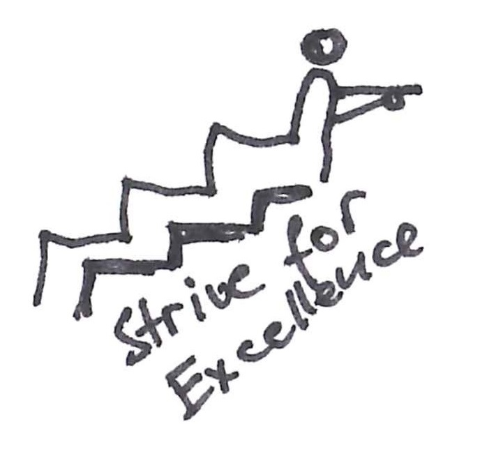
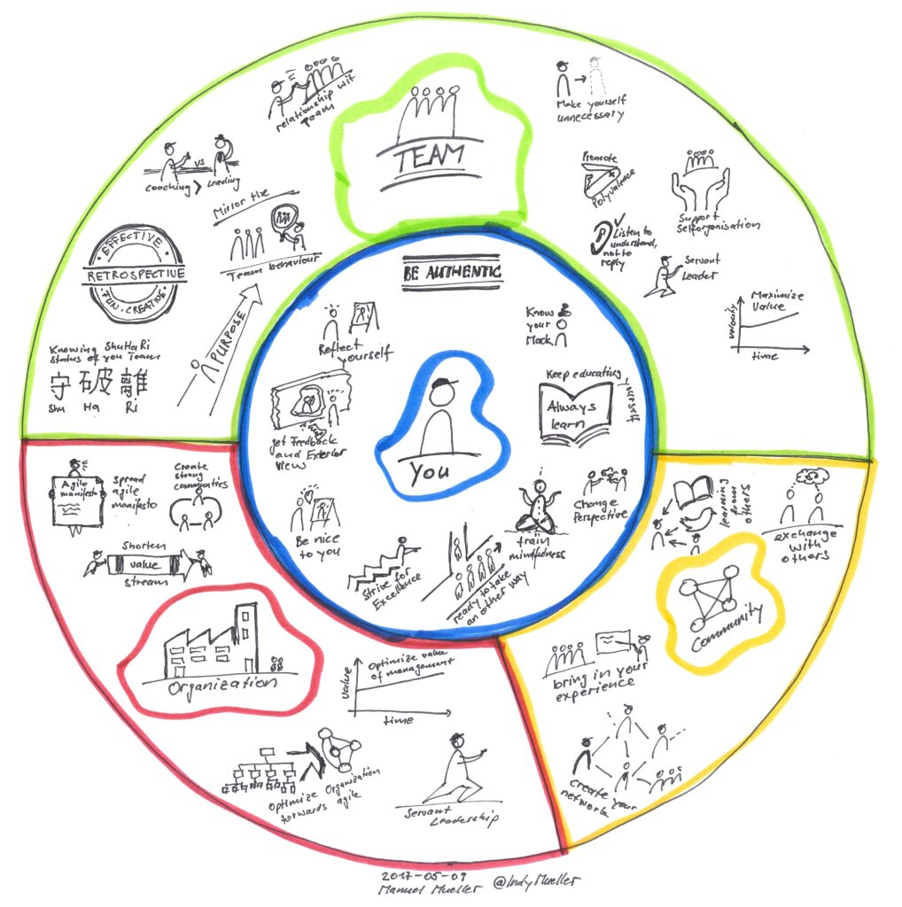

Ich bin nicht Fan von klassischen Kursen, wo man ein- zwei Tage hingeht an fiktiven Beispielen alles versteht und danach frustriert ist, wenn es in der Umsetzung in die Praxis nicht funktioniert.

Deshalb biete ich keine Kurse ab Stange an. Ich schneide die Programme auf deine Bedürfnisse zurecht, damit maximaler Nutzen aus dem Investment entsteht.

In folgenden Bereichen sehe ich Potential, wo es sich für Unternehmen lohnen kann ihre Menschen weiterzubringen. Um sich etwas darunter vorzustellen, bringe ich etwas potentiellen Inhalt mit hinein.

### Scrum für Entwickler

Dieser Kurs wendet sich speziell an Entwickler, die in einem Scrum Team arbeiten. Die Entwickler gewinnen hier Sicherheit im Umgang mit dem Framework und den unterschiedlichen Rollen in Scrum. Natürlich werden wir auch Software schreiben und Scrum praktisch erfahren. Was kann hier alles schiefgehen? Wie verhalten wir uns? Was sind die Anforderungen an uns?

Stichworte: CleanCode, Softwarecraftsmanship, TDD, Kata, Pairprogramming, Mobprogramming, Scrum

### Next Level Scrum Master

Dieser Kurs wendet sich an praktizierende, zertifizierte Scrum Master. Die Scrum Master entdecken neues Potenzial und Tools für ihre tägliche Arbeit. Sicherheit im Umgang mit unterschiedlichen Herausforderungen. Der Kurs ist gespickt mit praktischen Beispielen.

Next Level Scrum Master orientiert sich an Scrum Master - That Matters. Auf dieser Webseite findet man viele Unterlagen und Gedanken dazu.

Eine typische Struktur könnte z.B. so aussehen:

- Einführungstag und Definition des weiteren Vorgehens

- Fokus Halbtag "DU"

- Fokus Halbtag "TEAM"

- Fokus Halbtag "UNTERNEHMEN"

- Fokus Halbtag "COMMUNITY"

- Rampup

Stichworte: Scrum Master, Team, Dysfunktionen, Teamentwicklung, Persönlichkeitsentwicklung, Führung, Leadership,...
