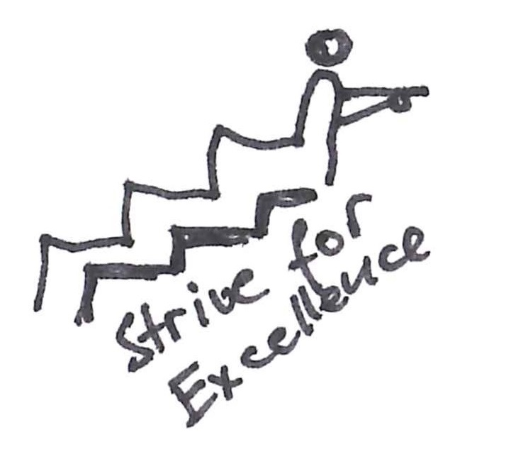
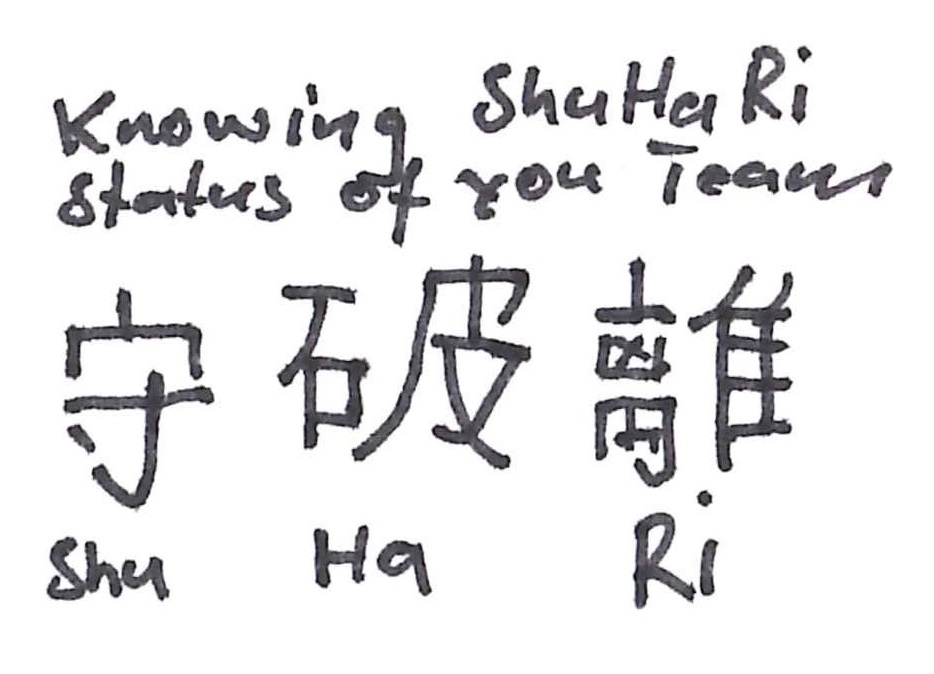
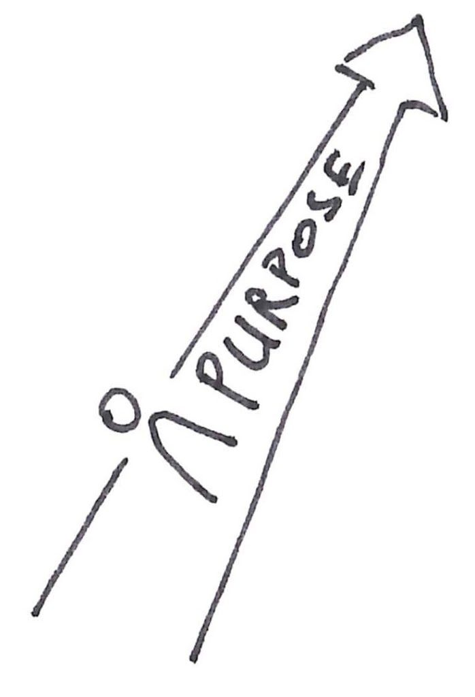
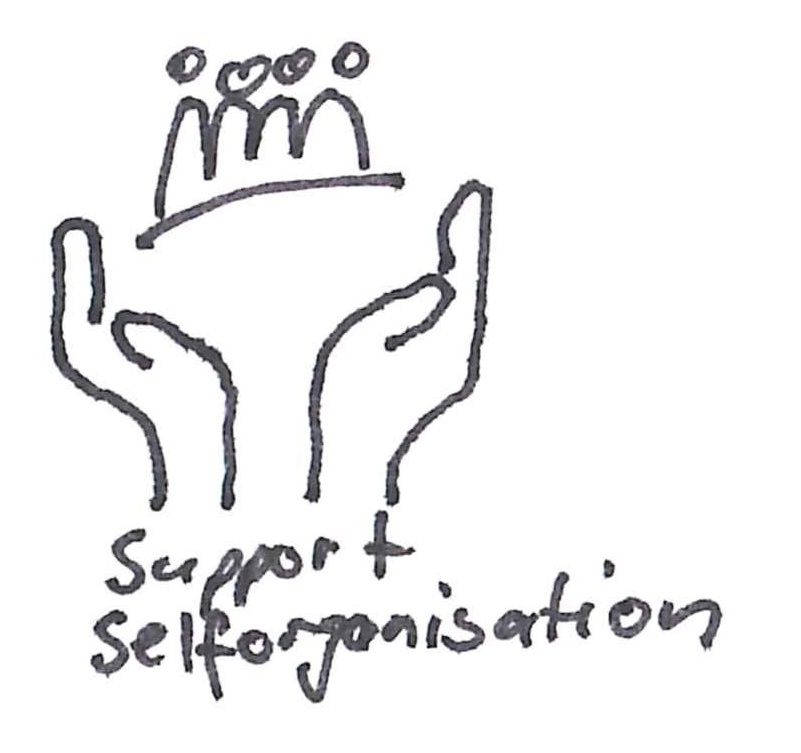

### **Entwickler**

Der Beruf des Entwicklers (insbesondere Software Entwickler) hat sich in den letzten Jahren stark verändert. Vom Befehlsempfänger von Analysten und Requirements-Engineers zum Dreh- und Angelpunkt, was technisches und fachliches Wissen angeht. Das erfordert andere Skills, die durch direktes Coaching gefördert werden können.

Als Coach für Entwickler kann ich besonderen Fokus auf die nötigen Soft-Skills legen.

* * *

### **Scrum Master**

Scrum Master sind zentrale Rollen in einem Unternehmen. Diese Rolle ist seit mehreren Jahren mein Stammgebiet. Dabei habe ich schon viele Hürden nehmen dürfen und dabei viel lernen.

Als Coach für Scrum Master kann ich helfen die persönliche Entwicklung anzustossen. Bereit für Next Level Scrum Master?

* * *

### **Product Owner**

Product Owner sind einer hohen Erwartung im Unternehmen ausgesetzt. Diese sind sehr herausfordernd.

Als Coach für Product Owner kann ich helfen die Rolle besser zu verstehen und damit mehr Wirkung im Unternehmen zu erzielen. Immer mit dem Fokus auf Wert.

* * *

### **Management**

Manager in einer Welt von selbsorganisierten Teams? Was ist hier meine Rolle? Braucht es mich noch?

Als Coach für Management kann ich helfen die Rolle zu schärfen. Nur weil Management in manchen Frameworks nicht erwähnt sind, heisst es nicht, dass es das nicht braucht. Jedoch in einer neuen, anderen Form.
