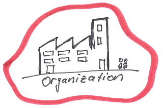

Der ständige Wandel um uns herum bringt für Unternehmen ganz neue Herausforderungen mit sich. Organisationen, die sich schnell sich ändernden Umständen anpassen können, haben auf dem Markt bessere Chancen.

Das haben wir doch wirklich schon zur Genüge gehört. Was können wir den wirklich tun?

Weisst du, wie Arbeit durch dein Unternehmen fliesst?

Auf welchen Unternehmensebenen triffst du welche Entscheidungen?

Als Coach für deine Organisation gewinnst du einen unverblümten Blick auf dein Unternehmen. Das hilft dir Haltung und Tun kritisch zu hinterfragen, eine wichtige Eigenschaft in der neuen Unternehmenswelt. Gemeinsam finden wir heraus, was für dein Unternehmen passt.
