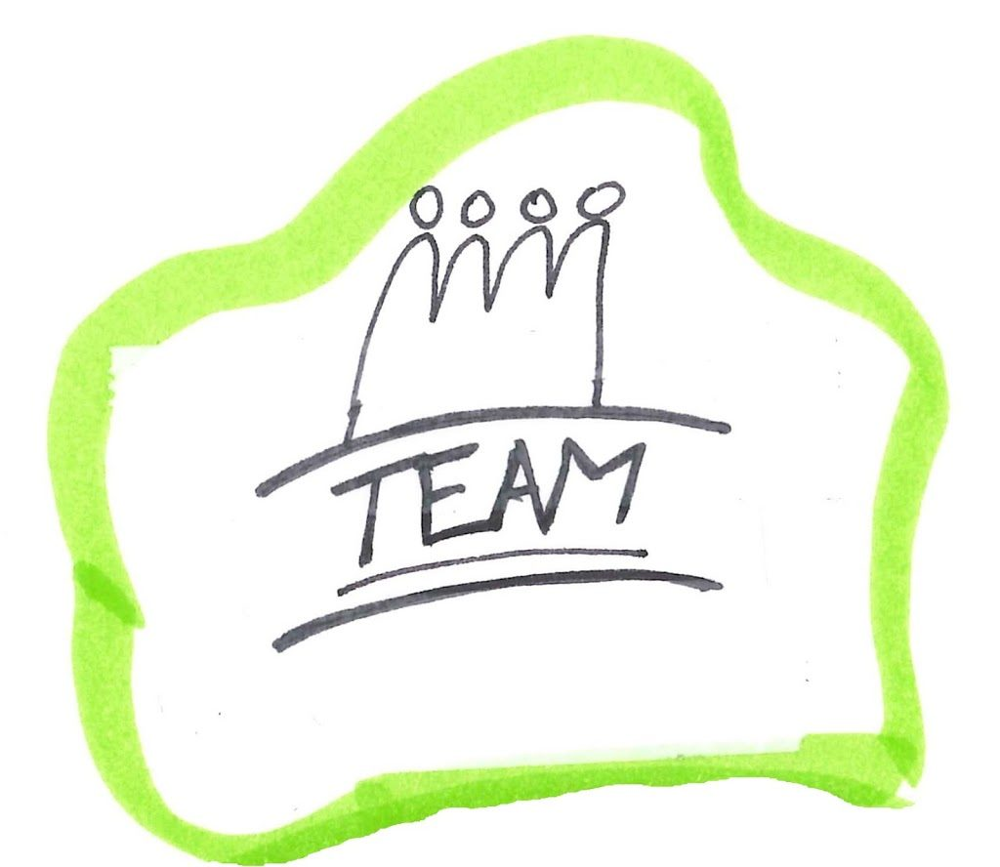

Wer kennt das Gefühl nicht? Als Team kommt man einfach nicht weiter. Wo ist bloss der Hacken?

Ich habe Erfahrung mit ganz vielen unterschiedlichen Teams sammeln dürfen. Technische Teams, fachliche Teams, Führungsgremien. Geschäftlich wie auch privat. Das hilft mir Team Situationen gut einschätzen zu können.

Als Coach für euer Team kann ich helfen Dysfunktionen zu erkennen, sichtbar zu machen und daran zu arbeiten. Das erhöht die psychologische Sicherheit in eurem Team und kann euch auf das nächste Level bringen.
