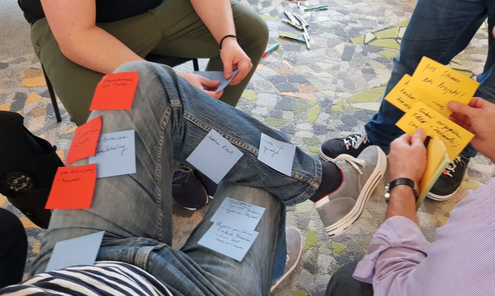
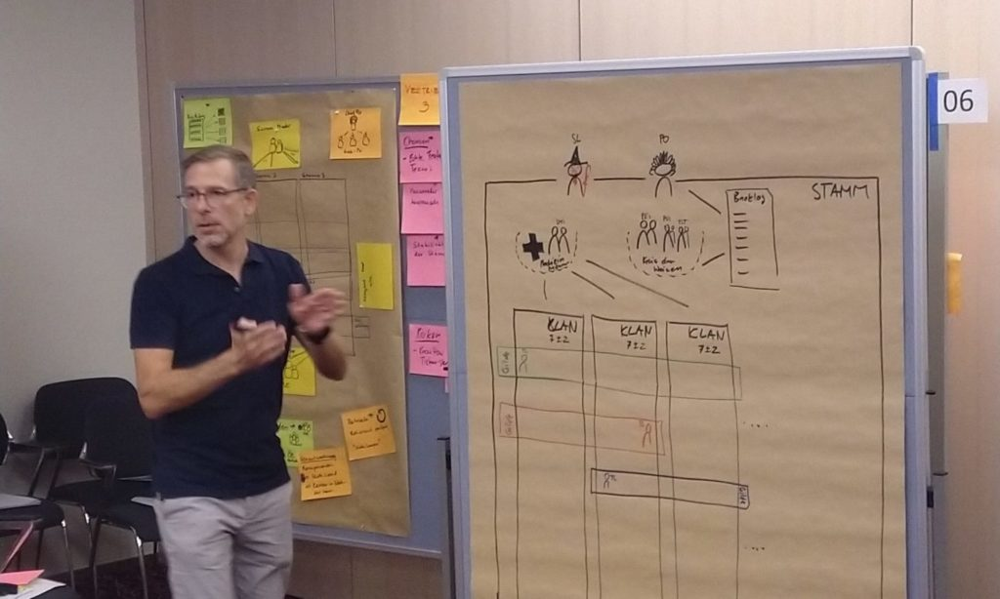
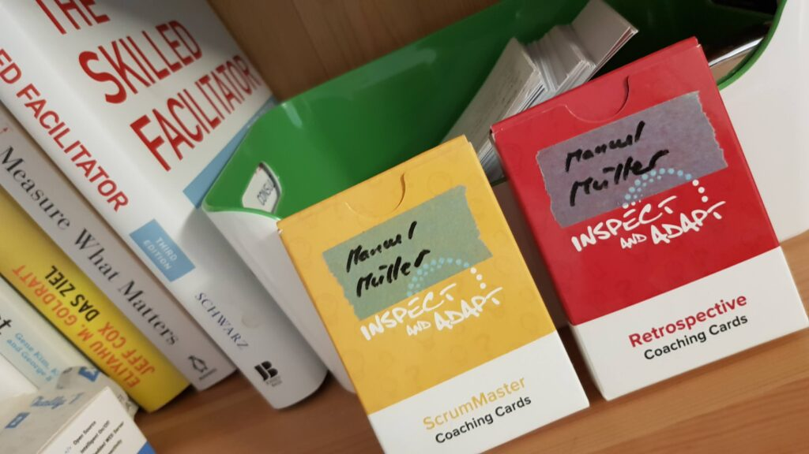
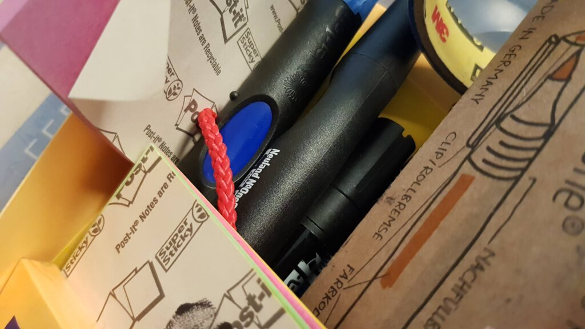
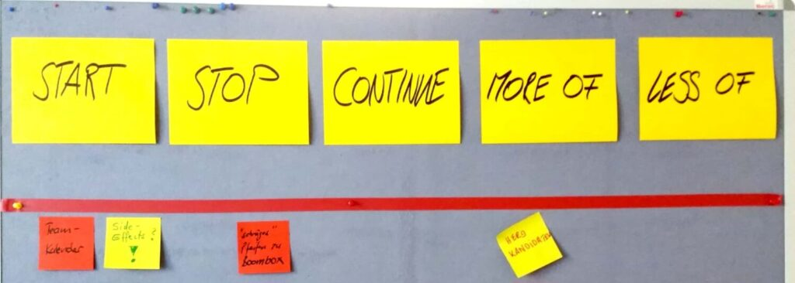

Manchmal hilft es einfach, einen externen Moderator dazu zu nehmen, weil eine neutrale und wertfreie Haltung von intern schwierig ist.

In den letzten Jahren durfte ich viel Erfahrung beim Erstellen und Durchführen von unterschiedlichen Formaten von Workshops machen. Als Moderator des [Agile Breakfast Luzern](https://www.meetup.com/de-DE/agile-breakfast-luzern/) im Bereich Community, Cross Company Liberating Structures Immersion Workshop, interne Scrum Days, unzählige Retrospektiven, Einzel-Coachings und vieles mehr.

<figure>

<figure>

<figcaption>

Konferenz Vortrag

</figcaption>

</figure>

<figure>

<figcaption>

Lightning Talk

</figcaption>

</figure>

<figure>

<figcaption>

Retreat

</figcaption>

</figure>

<figure>

<figcaption>

Team Self Selecting Workshop

</figcaption>

</figure>

<figure>

<figcaption>

Retrospektiven

</figcaption>

</figure>

<figure>

<figcaption>

Am liebsten live und in Farbe

</figcaption>

</figure>

<figure>

<figcaption>

Klassiker

</figcaption>

</figure>

</figure>
