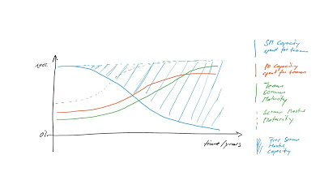

I am already had a [similar post](http://manuelmueller.blogspot.ch/2016_06_01_archive.html), but here I want to go for more options for the Scrum Master. In the meantime I came to another view to this theme.

Where ends the Scrum Master role? Generally you can say, that if you do Scrum with perfect self organized teams, with high level of Agile mindset there is no more need for a Scrum Master. Everthing is mastered by the Team and Product Owner. The team organizes their dailies, do the retrospective to continuous adaption. The Product Owner do his job properly and organizes the Sprint Review and Sprint Planning 1. Responsible for Sprint planning 2 is the team. What do you mean? Where is the place for the Scrum Maser role? If a Scrum Master do his job well, then he is digging his own grave. But should not that fact be the driver behind the Agility. When a Scrum Master reach this point then he achived the highest Scrum Master Maturity (and could check all points of [Great Scrum Master](http://www.barryovereem.com/characteristics-of-a-great-scrum-master/)). He is only needed punctually in the team. So to answer the question "Where ends the Scrum Master role?" : It end never, but the load is decreasing massiv after several months or years (depends on yourself) after starting with Scrum.

What do we do about the free capacity of the Scrum Master?

I have still a sentence in my mind. "A good Scrum Master can have more than one Team, a great Scrum Master can only have one". If the above curve just a little of truth, than this sentence make no sense. What are your Scrum Master do in this time?

I figured out 3 Stereotypes of Scrum Master:

**Stereotype 1:**

Scrum Master who loves to be developer enjoy to programm with the team. He is fully engaged on Sprint Backlog and is more a Teammember than Scrum Master. His backgound is professional developer and though he is going to be a key developer and know how carrier to the team. This mislead in dependency and full envolvement in the team. Could be hard to coach and train the team.

**Stereotype 2:**

He was never a developer. His comming from years of Teamleading. This Scrum Master will do the administration job for the team. He is involved in lot of synchonizing meetings. Usually he operates with hi administration in the team context and manages this perfectly (but over adminitrated). The team is happy to have this kind of Scrum Master, he does all the uncool work for them.

**Stereotype 3:**

This Scrum Master understand himself as Agilist and wants reorganized the organisation or at least try all possible ways to get more people involved to this Agile mindset. He do not support the team a lot, but he is a good Scrum Master to motivate other people to change her minds. This Scrum Master tend to coach other Scrum Master in there role and expect a lot from them.

Do you see yourself in one of this stereotypes? Do you see any other stereotypes in your organisation?

Please do not hesitate to write me an Email or make a comment.

mailto:manuel.mueller.meier@gmail.com
