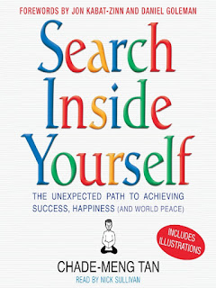

That is a realy hard question, isn'it ? Can you answer it for yourself. Try.  

  

In my opinion it is important that going to work is not a must. Sure, every one of us have to have some money in the pocket at the end of the day, but this should not be the main driver behind. And it is also clear that we do not have fun the whole day and we have sometimes uncomfortable work to do. But what you like to do most? Do more of them and you are getting more motivated. Another point is, try to have a positiv mindset, smile for you, it will help you to get over the uncomfortable things.  
To help you to reflect yourself and getting more mindful to your environment, please have also a look on [ascrum.blogspot.com](http://ascrum.blogspot.com/). There you can find some methods you can try to achieve more mindfulness. For this I can aslo recommend the book from Chade-Meng Tan.  

  
  
To enjoy work presupposes that you can work in social and fair environment. There should not be fear somewhere to do something wrong. Also you should have trust around you to act autonom and master yourself. If you then can see any purpose in your work you are on the right way.  
See also following video from Dan Pink.  
  

<iframe allowfullscreen data-thumbnail-src="https://i.ytimg.com/vi/wdzHgN7_Hs8/0.jpg" frameborder="0" height="266" src="https://www.youtube.com/embed/wdzHgN7_Hs8?feature=player_embedded" width="320"></iframe>

  

As Scrum Master you are in charge here to hold your team highly motivated. You can work out with your team your purposes. Why are you a team? Who is your sponsor? And do not forget: **Who is your customer?**

If you have answers to this questions, work hard to get a good relationship with youre stakeholder. Ask them what you can do better. They will help you, I promise.

It will high motivate you, if you know why and for who your build your application/product.

  

Make yourself a Master in what you do, will give you self-confidence and courage to do and try out things your not know at the moment.

  

What do you suppose to do, to get out of bed every day?
