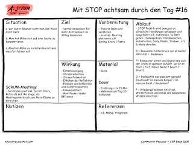
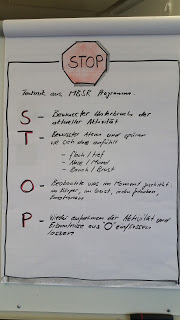

Hallo zusammen Gerne teile ich mit euch mein Erfahrung mit einer der Technik aus unserer Sammlung von ascrum. STOP habe ich in einer Retrospektive vorgestellt und die Leute aufgefordert es mal zu versuchen. Für die Vertiefung habe ich ein Poster im Büro aufgehängt. Ich habe keine Erhebung gemacht, wer die Technik nun regelmässig anwendet und eine direkt Wirkung in das Team habe ich nicht verspührt. Dennoch bin ich überzeugt, dass man fokusierter in den Tag geht, wenn man sich bewusst ist, was einem gut tut und was nicht. STOP kann einem helfen seine Gedanken zu ordnen. Mir jedenfalls hilft es, sich einmal im Tag ehrlich die Frage zu stellen wie es einem geht. Man lernt sich noch besser kennen, was für die Achtsamkeit immer gut ist. Mein Vorschlag, einfach mal ausprobieren und feststellen was es mit einem macht. Falls ihr Lust habt, könnt ihr eure Erlebnisse mit dieser Technik gerne mit uns teilen auf diesem Post. Viel Spass damit.

Gruss Manuel

