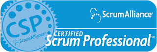
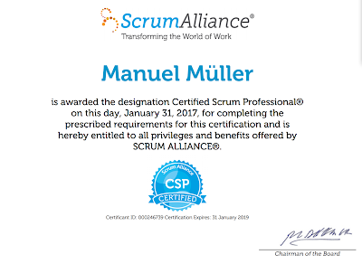

In the next lines I am going to show you my way to Certified Scrum Professional (CSP).  

A year ago, I was at a point where I really wanted to go deeper into the agile mindset. I had a good running team with respectful pace and mindset, but I had the claim to help my organisation to go further in the agile way. In my mind I had a naiv picture of a workplace where all employees are happy stressfree and care about each others in very professional attitude and high quality work. Sounds good, doesn't it?  
I believe very strong, that the agile movement could make the world a better workplace. If you have satisfied and intrinsic motivated employees you will receive a high quality work in the manner of craftsmanship.  
So I where looking for an further education in agility. In the "normal" education institutes like universities there where no possibilitiy to strenghten your maturity in agile. So I found the further education offer of [TheScrumTeam](http://www.dasscrumteam.com/).  
Modules for Prozess, Product, People, Quality, Organisation and OpenSpace where exactly what I had looked for.  
It was one of my best decisions I have made. During the last year I transform from a believer to a maker. I am not just believe that agile is good, I had know the power and reputation to do so and this makes me very happy. I have know the possibility to help my organisation to produce less waste and quality and customer focused products. We have to do so. The world is moving faster, and we have to prepare us for disruptive changes even in our old and dusty insurance industrie.  
During this education I personally changed from only be a ScrumMaster to an influencer. Not only this several days of education brings you to that change, also lot of books that I have read, and still have to read. Further is a great community of agile enthusiasts in the world, where you can get inputs.  
  
Another part of the education was to start a community project. We decided to address the human part of agile. In our project [ascrum.blospot.com](http://ascrum.blogspot.com/), we collect some excercises for minfulness. If you are at that point to also bring in mindfulness in your daily business you will gain even more focus and empathy in your team.  
  
All in all it changed my life. To see the work to be a part of your life.  
  
My mission  
Make the world a better workplace, be professionell and respect your own and your collegue.  
  
  
  

