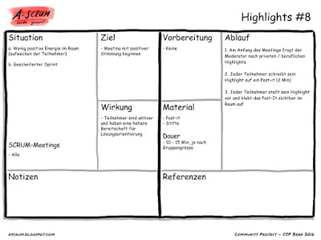

Hallo zusammen Ich kann euch einen weiteren Bericht aus der Praxis geben, aus den gesammelten Methoden von A-Scrum. Highlights #8 eignet sich sehr gut um in ein beliebiges Meeting zu gehen. Dadurch kann man es mit viel Energie füllen. Ich habe diese Methode etwas modifiziert. Und zwar lasse ich nicht nur das Highlight aufschreiben, sondern auf die Rückseite des Sticky lasse ich von den Teilnehmern aufschreiben, was sie aktuell beschäftigt und davon abhält ganz hier zu sein. Wenn man ein Meeting so eröffnet, zeigt dies auch an, dass hier gleich etwas Wichtiges geschehen soll und man nicht vergebens zusammengekommen ist. Das macht man ja leider schon genügend. Viel Spass beim ausprobieren. Wenn ihr Fragen habt, meldet euch doch über diesen Blog, ich unterstütze euch gerne.

Gruss und einen tollen Start in die neue Woche. Manuel

