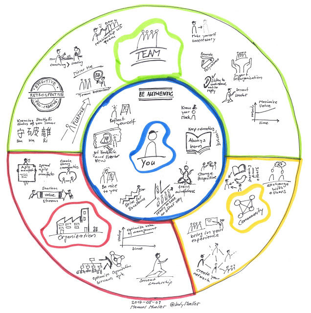

Hi ScrumMaster's Have you ever ask yourself what really matters for your Job? Where you should have Focus on? What is expected from this role? I have made some experience I would like to share with you. This experience are based on my own work with different teams, but also from books like Scrum Mastery from Geoff Watts, Whitepapers from Barry Overeem and other inspiring articels on the web. My way to Certified Scrum Professional did also have Impact to this. Maybe there are some ideas you can benefit from.

Idea Proportions in the following picture are not choosen at random. You-Team-Organization-Community. In this order I see the responsibility in the role of a ScrumMaster. You have to be ready for this Job, then you can bring your Team to success and out of your success you can help the organization to become better in agility. After all, the community is thankful, if you share your experience with others, so the agile movement can grow. **You** - ScrumMaster is in the Center and is the most important part of it. You have to be sure to do this role without compromises (100% ScrumMaster). You are the architect of your own fortune. **Team** - ScrumMaster's Job is to bring your Team to success. **Organization** - ScrumMaster should have significant influence in how we Change the organization towards agile **Community** - Share your experience with others. Tell your Story.

Later on this blog I am going to describe each of the small Picture what I understand behind. Maybe I can tell a Story about each of it. Do you have a Story about your role as ScrumMaster? What else do you see? Do you have any Feedback?

I would love if you like to share your Story about your experience. Please use this thru comment on this site, twitter to @IndyMueller or Email me (manuel.mueller.meier\[at\]gmail.com).

 

Thank you for your Feedback, contributions, ideas, inspirations, comments on this.

Greets Manuel
