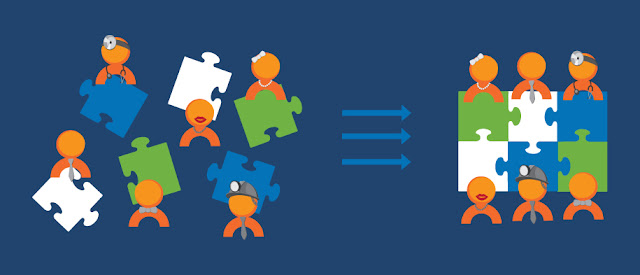

Do you have a crosssfunctional Scrum Team? How many different Specialist do you have? Are they all "cross" enough to act and deal with all the work that accrues?  
  
Yes!  
Great. You should be happy and stop reading this post and use your time to produce some value.  
  

  
  
No?  
Then I recommend to read further. Maybe I have some Ideas to deal with this challenging situation.  
  

  
  
According to the Scrum Guide we have only one role in the team. The Dev role. But this role faces a lot of different skills.  
\- writing User Stories (if the PO delegates it)  
\- communication with customers  
\- full stack developer skills  
\- Testautomation skills  
\- Testmanagement skills  
\- Operation skills  
\- Support skills  
\- ...  
Maybe there are other things. But let us be honest. Do you know someone who could cover all this skills in a professional level. Then please give me the contact coordinates I have a employment for her/him. ;-)  
Because of the situation above we have different professionals in our teams. So what do we do to not fall back in to a classical waterfall, where the requirements engineeer writes the stories, some developers are programming and afterwards your tester is in charge to save the quality.  
If each professional discipline knows something about the disciplines at left and right hand, we getting much more flexible in working out of the backlog. It is not possible to define or plan the exact amount of work for each discipline. If we do not learn from others, we working on items with lower prio or even on items not in the backlog, just because we wanna not bore out.  
With T-Shaped people, flow can arise. The team begins to perform and learn a lot. If the team is stable for a while, they can perform even better, because they learn from other disciplines.  
Key values for such a culture are:  
\- eager to learn  
\- fail fast, learn fast  
\- commitment  
\- focus on customer value  
\- ...  
  

  
To increase this, the employees can learn the business domaine well. In this case they can judge the value for customer even better and come up with new ideas for the product. The customer is even more satisfied, when the Scrum Team talk in customer language.  
Such employess are + - shaped. Specialist in one discipline and business domaine, able to work with neighbour discipline very well.  
  
What is your opinion to that?  
Let us discuss.
