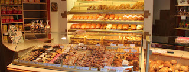

Real happend story....

I like to share with you a real life situation about....see yourself.

In the early morning I went to a bakery to buy some sweet stuff for my team. For my surprise the showcases were nearly empty. No problem I thought, I will going later to buy it. An hour later I face the same situation. It was nearly eight thirty and the stuff should be in office on coffee time, so I asked at the desk were all the nice peaces were. They answer me, that the whole crew in this store did not have time to take out the sweets from the stack of crates and fill up the showcase. Instead every saleswoman had to lift off each crate to looking for the customers needs. The whole team optimzed here in my opinion to the false target. They had only focus on the customer they come in the store to service their needs, not realizing the time they lost to find the sweets in the crates. Each customer had to wait much more time than usualy, and so the line becomes longer and longer. I don't know when they catch up the line and find time to fillup the showcases.

What shows us this story? For me I see an analogy to technical dept. The stacked crates full of sweets are technical dept and because of customer needs the team will not have attention on it. But when they would reduce the technical dept, they could serve the customer much more efficient. Conclusion is, satisfing customers is important, but do not only optimize one side of the medal. Be aware of technical dept that holds you up to do an efficient job.

What else do you see? Please share your story or conclusion with me.
