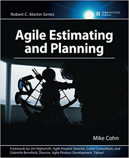
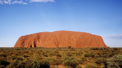
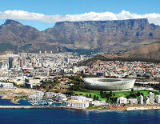
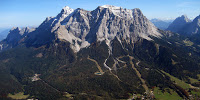
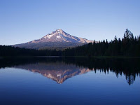
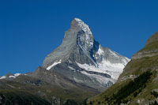
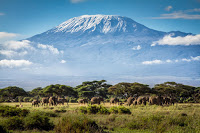
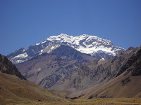
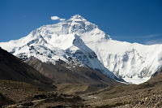

Hi Scrumers How do you estimate in your team? Could your team make the step to relative Estimation? If not, maybe this post can help you establish relative Estimation in your team. As ScrumMaster you know all the Theory of relative Estimation from your ScrumMaster Course or Certification. If not, I recommend the following book for you.

Or following Links:

[Agile Estimation, Mike Cohn](https://www.mountaingoatsoftware.com/presentations/agile-estimating) [Effective Estimation, Robert C. Martin, Uncle Bob](https://youtu.be/eisuQefYw_o)

There are much more blogs about it.

For relative Estimation where recommend StoryPoints as an abstract size of a Story. I find this very useful and it helped me to find the way out of time based estimations. But for a lot of people it is hard to make this switch. Mike Cohns recommondation is here to use DogPoints. You take the different dog races from its size. I do not know anything about Dogs and so I had to find something else as further abstractation. I live and work in Switzerland and here we are surounded with mountains and hills. So I find it a useful idea to create the mountain points. A good part of this abstraction is, that you can adapt to your knowings about Mountains. For this post I try to be as international as possible, but for your team, it would be useful to use mountains and hills they already know. The mountain points are still in the fibonacci row, this is essential for our estimation. The gap between estimations should become bigger with higher estimation because of the uncertainty that lays in the nature of estimation.

Following Questions could you ask then:

- Is the effort for this Story more like a walk to Tablemountain or a hike to Zugspitze?
- Is the risk of the Story like a expedition to Kilimanjaro?
- ...

 

| Mountain Point | Mountain | Picture |
| --- | --- | --- |
| 1 MP | Uluru (Ayers Rock, Australia, 350m) |      |
| 2 MP | Tafelberg (South Africa, 1000m) |      |
| 3 MP | Zugspitze (Germany, 2962m) |      |
| 5 MP | Mount Hood (USA, Oregon, 3429m) |      |
| 8 MP | Matterhorn (Switzerland, 4478m) |      |
| 13 MP | Kilimanjaro (Tanzania, 5895m) |      |
| 20 MP | Aconcagua (Argentinien, 6962m) |      |
| 40 MP | Mount Everest (Nepal, 8848m) |      |

 

What do you mean? Could that be helpful to your team? Let me know and give me some feedbacks to it, I would very appreciate.
