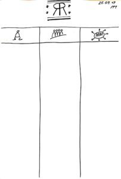

Hi ScrumMaster  
Looking for a Retrospective who can held outside the office? Do you enjoy eating together in team? Then probably I have something for you here.  
  

# The Restaurant Retrospective

## Introduction

### Speeddating

- let the team members sitting in front of each other
- 90 sec talking about a any topic (you can easly make it 2min)
- after time is up, let them rotate
- rotate as long as you feel energy or your timebox is up

## Improvement Retro

This technique is near the creative technique 6-5-3, this you can find [here](https://en.m.wikipedia.org/wiki/6-3-5_Brainwriting).  
For this method I created a simple paper with three columns (You, Team, Outside Team), as you can see in the picture.  
Create your own paper to make it more yours.  

First round, every Teammember writes an improvement or an idea in each of the column. Give them around 5min to come up with truly improvements.  
Afterwards pass the paper every 2-5min in the direction of your choice. Ajust the time to your needs or maybe depend on your team size. Let the Teammembers write down concrete actions to the improvement and/or ideas. Pass the paper as long in the same direction until everyone has its own paper back.  
  
Now everyone has a paper full of concrete actions. Each of the Teammember notes one of the actions from each of the columns on a little paper with different colors. The action from column "you" everyone can take it for itself and could ether make it transparent or not. With the column "Team" you gonna prioritize with the team and take out as many actions which is meaningful for the next iteration. Columns "Outside Team" your gonna prioritize the same way and take the most important impediment and try to solve it in the next iteration. It depends on the impediment if you or your team has to take the corresponding actions.  
For priorization you can use ether use election by using to point for each member to mark its favorit action or priorization with sorting against each other until the urgent action is on top.  
  
After this hard work, enjoy your meal together to give it a nice final.  
  
Make sense? Try it out. Let me know if it has worked or not for you.
