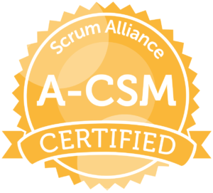
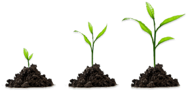
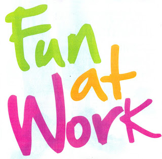

Since the agile movement, the role of ScrumMaster has changed in my opinion. At the beginning there where more or less single teams who practice with scrum. The ScrumMaster had to care to the process and protect the team from outside interuption. More and more organizations practices Scrum with multiple teams. In a scaled Scrum environment the role of a ScrumMaster has expanded to organization transformation.  He has to optimize the environment for the teams to perform. To reach this, ScrumMaster have to deal with management. In my experience there are many ScrumMaster they do not want to deal with management and hold hard on team focus. The effect is a very local optimization, which can end up in different culture, different implementation of Scrum or even back to ordinary team constallation. To prevent this, the ScrumMaster of an organization have to be learned, teached, coached to deal with here role for external focus. Often they are not aware of this, that they have this responsibility. It is important, that management allow and support the ScrumMaster to work and make change outside the teams. Management must learn to give responsibilty and trust to the ScrumMaster and give their earlier competences to them. To do this, it is eminent to invest the maturity of your ScrumMasters (e.g. A-CSM).

The management has a new role in such an environment. They have to support the ScrumMaster and accept their changer role. The responsibility of the management is to support such an growing environment. Often it is difficult for managers to give up their earlier responsibilities. But they have this new responsibility to look after the agile environment just like to look after a plant. Give them water (challenges, learning atmosphere), fertilizer (feedback, esteem), sun and light (positiv thinking, support) to grow faster.

For me personally my role as ScrumMaster is the most fullfilling job I have ever done. Working with people let them grow, make Teams great and work more meaningful with much less stress situations and very much more fun. This makes going to work much more fun.

