[ScrumMaster - ThatMatters](https://www.agilistic.ch/index.php/2017/05/12/scrummaster-thatmatters/)

[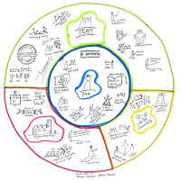](https://www.agilistic.ch/index.php/2017/05/12/scrummaster-thatmatters/)

[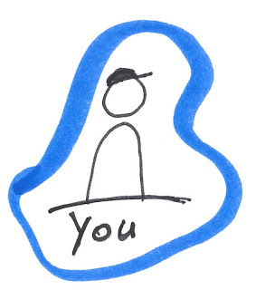](https://1.bp.blogspot.com/-EOY5SRGh1tA/Wd7xslDfaCI/AAAAAAAAQdw/DG0m_AzLQ1cbcH7JPo4bB0CTR-6X07MxgCPcBGAYYCw/s1600/ScrumMasterThatMatters_You.jpg)

Most important for a ScrumMaster is to look after himself. For you it will be essential to live what you belief in and hold the flag upright. You have to be agile, not acting agile. Working on your facilitator, teacher, mentor, leader role and striving for excellence. It is hard work, because of the diversity, but in my opinion the most complete role you can have.

How you can do that? Read books, follow the world agile leaders, conferences, local community and most important experiment with your idea, inspect and adapt. For this, change your flight height to see more in the hole context, what is going on in your team and with yourself.

If you read further, your will find some important things in my opinion, that matters to you. There will be more points to look after, belief me.

| Picture | Description |
| --- | --- |
| [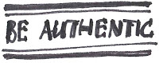](https://4.bp.blogspot.com/-AzHxse9tqJw/Wd7xsh_RKzI/AAAAAAAAQdw/hvxDlacWWvsgOaeCy31F_dfI8nMzp9-vQCPcBGAYYCw/s1600/ScrumMasterThatMatters_You_BeAuthentic.jpg) | Be Authentic means, not lying to yourself. I feel this as a very central aspect in the work of leader roles. Specially in the agile context. The hierarchy context allows you or even forces you to play the business theater. If authenticity is missing in the agile environment, there will be a lack of openness. One of our Scrum Values! |
| [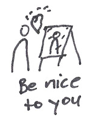](https://1.bp.blogspot.com/-Wfp_i3lqn-8/Wd7xsn1TXqI/AAAAAAAAQdw/UTw9h4T1irkhdSftVKJB3aD5aXxRMEwXgCPcBGAYYCw/s1600/ScrumMasterThatMatters_You_BeNiceToYou.jpg) | Be nice to you means, to respect your self as you are. This colors your behaviour against the team. If you can see yourself positive, you are able to project it to your team members. |
| [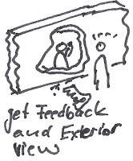](https://4.bp.blogspot.com/-0UAvqZx5Mww/Wd7xsvW5SSI/AAAAAAAAQdw/3aE18Ew_r-Qc7BBAWgnyAS1FrzSR2iA7gCPcBGAYYCw/s1600/ScrumMasterThatMatters_You_GetFeedbackAndExteriorView.jpg) | It needs courage to get some feedback from your colleagues, but it makes you feel better. You will going to know you better ([Johari Window](https://en.m.wikipedia.org/wiki/Johari_window)) and the mutual understanding will be growing. Feedback is a gift and you can turn something on or not with it. To know your outside reaction is very helpful. How do you effective to others? How I act in certain situations? Your environment can give you this information much better, faster and more honest than you can do for yourself. |
| [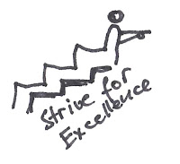](https://1.bp.blogspot.com/-e2WEDqsfobE/Wd7xsqQTQzI/AAAAAAAAQdw/c1hRsfaYixQv4Dq-oEihShzUixR1H55KgCPcBGAYYCw/s1600/ScrumMasterThatMatters_You_StriveForExcellence.jpg) | Strive for excellence is the willingness to do things as perfect as possible and concurrently know how that it could be even better. But also to accept a solution that suits the requirements and not working on golden tabs. Excellence is also to know the next level for you. How the top cracks doing it? What can I learn from them? |
| [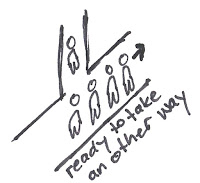](https://1.bp.blogspot.com/-nWccE-JYj3E/Wd7xsuaXEDI/AAAAAAAAQdw/Umx6B3Nn6uIGr-LrwFY2qH1mmAa8ou9uwCPcBGAYYCw/s1600/ScrumMasterThatMatters_You_ReadyToTakeAnotherWay.jpg) | Courage and willingness to go another way could be very hard. Success is not guaranteed but at least you have won new experience and perspective. Like Nelson Mandela: "I never lose. I eather win or learn."   |
| [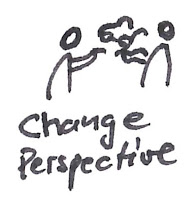](https://2.bp.blogspot.com/-SAdFyy-uBZM/Wd7xsh_P0GI/AAAAAAAAQdw/FRAhXn-uX5ow-PmUnjXsIwI4YlzwLde_wCPcBGAYYCw/s1600/ScrumMasterThatMatters_You_ChangePerspective.jpg) | In a dialog often you not really understand the other person. If you going to discover the other person environment and motives will help you better understand the other part. If your are able to get the other persons perspective is emphatically and encourage and effective collaboration. |
| [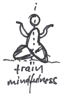](https://4.bp.blogspot.com/-WaNdFpyHlqw/Wd7xsvG5NfI/AAAAAAAAQdw/M-A4BFG2tMYHKliR_kFVgTco9esKAP6KACPcBGAYYCw/s1600/ScrumMasterThatMatters_You_TrainMindfulness.jpg) | Mindfulness is the base of empathie and self-image. If you know your self good enough, you are able to influence you behaviour in some situations to get more out of it. If you train mindfulness you are also train to focus and be present in the moment. Also it will help you in the active listening to your conversations. Further more it is science proofed that you are will be more stress resilient. If you want to go the first mindfulness steps with your team, please join the [A-Scrum](http://ascrum.blogspot.com/) Blog. |
| [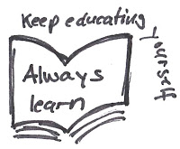](https://3.bp.blogspot.com/-41C1YCzsojI/Wd7xsoGqloI/AAAAAAAAQdw/Uar0aWSIwhE_Yokkz49mt9Vxs8NYcSaLwCPcBGAYYCw/s1600/ScrumMasterThatMatters_You_KeepEducatingYourself.jpg) | Willingness to learn will grow your horizon or in the learning zone model your comfortzone will be streched. With the time your adicted to the learning zone. It helps you to get the security and confidence in what you do. It will you open new perspectives. |
| [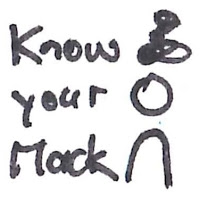](https://4.bp.blogspot.com/-k2C4fZy6LzY/Wd7xsmIYhsI/AAAAAAAAQdw/ocoC5b0XSgcvcYw-wdKB2id2FdjGRGmkACPcBGAYYCw/s1600/ScrumMasterThatMatters_You_KnowYourMacks.jpg) | To know yourself good could help to influence your behaviour in certain situations. So you can inspect and adapt your behaviour (maybe you in your speeches you say the word ähms, right, OK or else a lot). If you are good trained in mindfullness you can eather see comming a certain situation in advance and you have the option to react in other way then your usually do. But it is OK if you have a certain mack. Only if you are deliberately about it helps you. If you are very good reflected, you are able to see yourself from the outside and so you are able to influence it. Videos and Feedbacks from collegues can also help to get a outside view. |
|  | Selfreflection is a gift that differs us as humans and is a property which is very precious. It is similar to "know your macks". But it goes a little bit further. Why I react in this situation like this? Was it appropriate or did I triggered something that I don't want it? What can I change in my behaviour to avoid such situations? Here too, it helps if you train mindfulness to sharpen your senses for your selfreflection. |
|  | . |
