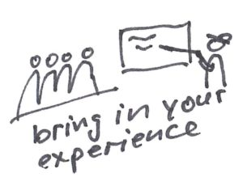
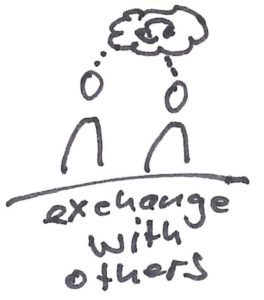

[ScrumMaster - ThatMatters](https://www.agilistic.ch/index.php/2017/05/12/scrummaster-thatmatters/)

| Picture | Description |
| --- | --- |
|      | We fight for the same thing, so let's learn from each other. Tell your story, experiment with new things and report about it. |
|      | A network inside and outside the company helps you to get feedback and other views. Learn new knowledge and no-knowledge and stay on the pulse of the agile movement. |
|      | Certainly agile enthusiasts will meet near you. Search for Agile Breakfast, Agile Beer, Meetup Groups, LinkedIn, ... Go, get involved and try to contribute. |
|      | Use the online channels to stay up to date. Learn what's worth reading. Find articles, experiments and new ideas that you can bring to your team. This resource is very large. |
