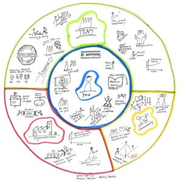
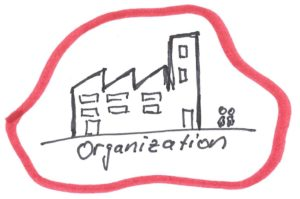
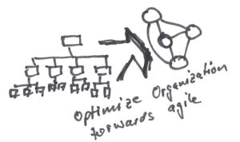
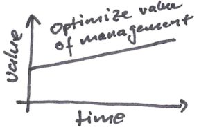

[ScrumMaster - ThatMatters](https://www.agilistic.ch/index.php/2017/05/12/scrummaster-thatmatters/)

| Picture | Description |
| --- | --- |
|      | Tell people in the organization about the agile principles and the values ​​behind them. Also motivate them to act accordingly. |
|      | Create communities that promote excellence in their domain. This creates a cross-functional collaboration between the teams. This exchange promotes mutual understanding and can be the glue of the culture. Overall, a venture benefits greatly because it employs highly educated people who remain marketable. The organization can continue to evolve and not stop. Keyword, learning organization. |
|      | Know alternative forms of organization and eliminate waste. |
|      | Support the line and management in being the empowerer for agility. Tell them how they can best help you. |
|      | The ScrumMaster has to show existing management what Servant Leadership is and consistently demonstrate this to themselves. The abandonment of power and the restriction of one's ego are very difficult for leaders from the "old" world. |
|      | Companies tend to address optimizations only locally. A typical example is exaggerated process models, hordes of business analysts and for all there is a project leader. These people are employed and must be employed. Unfortunately, these works and projects are often not customer-oriented, but serve the utilization of the employees. In addition, it prevents continuous product delivery. There is no flow. Product development is effective if it works continuously and in a timely manner. Otherwise, a lot of waste is produced. This is best optimized in **one product with one PO**.     |
