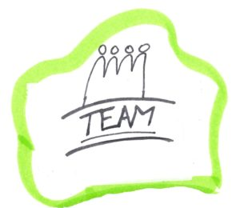
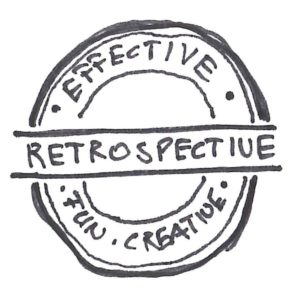
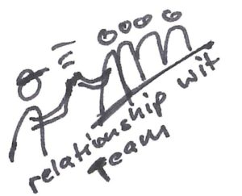
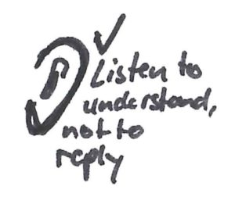
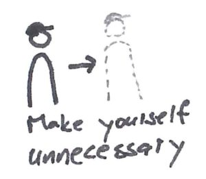
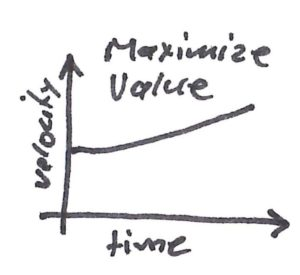
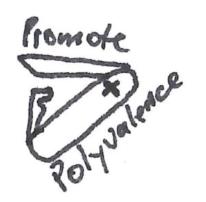
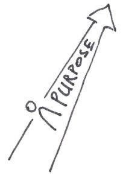
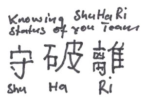
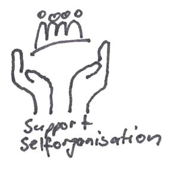

Teams are the Scrum Masters home base. She is responsible to support and serve the team. It must be the Scrum Masters passion to strive to greatness with the team. This is hard work but also rewarding if you see the growing teams and the fun they developed to work together.

Here you can find some tips and tricks. There are very much more. If you have any, please do not hesitate to comment this blog.

As Scrum Master you live in many different leadership roles ([8 Stances of a Scrum Master](https://www.scrum.org/resources/8-stances-scrum-master) ). The most important thing is to claim to help others become better. This can be done as a coach, mentor, teacher, etc. It is important to recognize in which status ([ShuHaRi](https://www.blogger.com/blogger.g?blogID=148351616029715580#ShuHaRi)) the team and the individual members are.

Active and well-managed retrospectives are a amazingly effective means of improving the team (and also the organization). The impediments must be processed consistently by the Scrum Master. It should be transparent which improvements are being worked on. The Scrum Master must develop a flair for a good retrospective method and use them purposefully. This can help the book "[Agile Retrospectives](http://www.estherderby.com/books)" by Esther Derby and Diane Larsen, or the Retromat by [Susanne Baldauf](https://plans-for-retrospectives.com/).

As a Scrum Master you should build a relationship with the team. This way, you get to know people who appreciate their values ​​and attitudes. The Scrum Master should be aware, however, that he does not belong to the DEV team. As an example, one can imagine a coach of a football or (in the scrum environment) of a rugby team. Relationships should not weaken the objectivity and neutrality. The Scrum Master is often perceived as a very strong role in a team, and he already has some sort of leadership role, for the simple reason that he leads the process and has the job of making the team better every day.

Listening to understand, not to answer. As a Scrum Master I find it especially important that you can listen active. This means listening while listening to the meta-level and listening between the lines. Frequently, the real problems are not what is said but what is not said.

Only when you no longer needed in the team is your job done. Strive to make yourself redundant to the team. Do not worry, you will not run out of work. Finally, you can dedicate yourself to yourself, the organization or the community. And rarely do teams stay stable for years. Every change in the team requires the Scrum Master again increased attention and teamwork, as the team has to find themselves anew. It falls then again into different phases of team development.

With agile or empirical development methods we pursue the goal of constantly asking ourselves whether what we do also benefits us. You should ask yourself and the team this question time and time again. For example with the question: If this was my company, would I do that? Would I pay for this sprint? What is the output of the team worth? It is the responsibility of the team not only to work on the "how", but also to take care of the "what".

Reflecting the team is an important part of the daily work in the team. As we are not going to lead the teams and lead them on their own, it’s important to be able to show the team what’s going on and alert them to their behavior instead. It reflects his perception as neutral as possible, so that the team has the chance to change something. It is important to me that the team can decide and ultimately have to live with this decision. By means of an example: How they want to proceed exactly when processing the sprint backlog .

In order to be able to process the resulting backlog uncompromisingly according to ranking, it helps if the team can support each other. Ideally, one has T-shaped individuals with broad general knowledge and deep expert knowledge in a specialty. A branch of the T represents business, the other technical know how. Business know-how is important, in the sense of "know your customer".

Give the team purpose and meaning. It helps them to get excited and motivated for their work. It is one of the intrinsic motivational factors behind [Dan Pink](https://www.youtube.com/watch?v=u6XAPnuFjJc), Drive.

Shu Ha Ri are terms from martial arts. How they are defined for agile software development teams, you can read [SuHaRi](https://martinfowler.com/bliki/ShuHaRi.html) from Martin Fowler. Your team can be in different status and you as Scrum Master (Martial art master) should develop a sense for the state your team are in, to support it effectively. In short term:  
Shu - Following the rule  
Ha - Breaking the rule  
Ri - Being the rule

Help your team to help themselves. Deliberately give them tasks they want to deport to Scrum Master. Be it reviews of bugs, presentations at the review, opening the dailies or even Scrum Events. Example: Stay aware once the Daily begins. Observe and mirror the team what you saw. Explain the purpose of the Dailys if you feel the team is being ineffective during this event.
