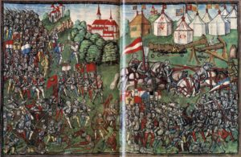

## Battle Workshop

In the method "Battle Workshop" we have two groups, each in a extreme position or opinion. A third group observs what is going in and give each round feedback and summarys to the hole group.

 

### Example

#### Opinion 1

What a feeling to have a group which is reaching a goal together. No one have the feeling that someone did not give all his power and passion to that goal. That is stuff from which are high perfomance team made. To count on everyones will to get to the next goal.

#### Opinion 2

Or is this all a feeling we should only have in our spare time, when we have really fun. Maybe to have a hike together and reach the top of a mountain. At work we have to sit, be quiet and deliver what was commanded. Only this way an organisation can have success.

### Procedure

We go together in the groups and make a battle plan, write down some arguments.

We argument with all we have against the other team for a certain time. You will recongnize when the energie is up. In my workshops it differs between 5 and 10min. To make it even smarter you can can separate the group so they do not see each other. So they have to listen active and carefully to one another and the gestiks or eye rollers are not relevant.

Beneath you will have the supervisor group which notes what is going on in the battle. They note meta information and also hard facts which the both teams smash against each other.

Do not forget to bring some fun in it, not that you have to intervate if it is going to be physical ?.

After the first round and the supervisor give a summary of what had going on, you can start a further round. Maybe you can give them the advise to check out common senses.

After two runs around 10min and the summary, normally I started a diskussion with the group. How they feel in their role? Was it easy to argument? Who wins the battle?

This workshop is intensiv, fun and brings you new insights to the other opinion. You learn better understanding the other part, you learn listen actively and carefully. Try it out, and let me know your learnings.

You can run this battle workshop with any theme where you have two opinions or options.

Cheers Manuel
