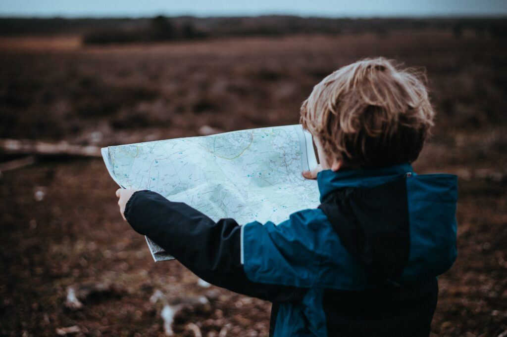
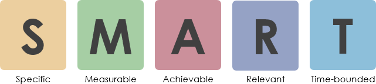

If you know about hiking then you are aware to take a map with you on your trip. These map guides you through your hike and show you were you are, what way you have already realized and how much you will have to go. A map is also very helpful if you are stuck in foggy/snowy weather where you can not see very much. It is also useful to explore the near peaks around you.

<figure>

<figcaption>

Photo by [Annie Spratt](https://unsplash.com/@anniespratt?utm_source=unsplash&utm_medium=referral&utm_content=creditCopyText) on [Unsplash](https://unsplash.com/s/photos/map?utm_source=unsplash&utm_medium=referral&utm_content=creditCopyText)

</figcaption>

</figure>

**Like the map as a not optional tool, so is the hypothesis for experiments.**

A hypothesis is a helpful guide through your experiment. You can regularly reflect on it and change the experiment if needed. It supports you also if have defined a fix end of the experiment to measure your success.

What is a good hypothesis?

<figure>

<figcaption>

_https://www.visual-paradigm.com/scrum/write-user-story-smart-goals/_

</figcaption>

</figure>

- Specific: It measures one aspect of the experiment.
- Measurable: Be clear how you can proof your hypothesis.
- Achievable: Set realistic goals.
- Relevant: Is the hypothesis relevant to the greater experiment or the context in which the experiment is performed.
- Time-bounded: In which time you are going to achieve the hypothesis.

Maybe this S.M.A.R.T. format, which is originally from the context of User Stories, could help you define proper hypothesis for your next experiment.
