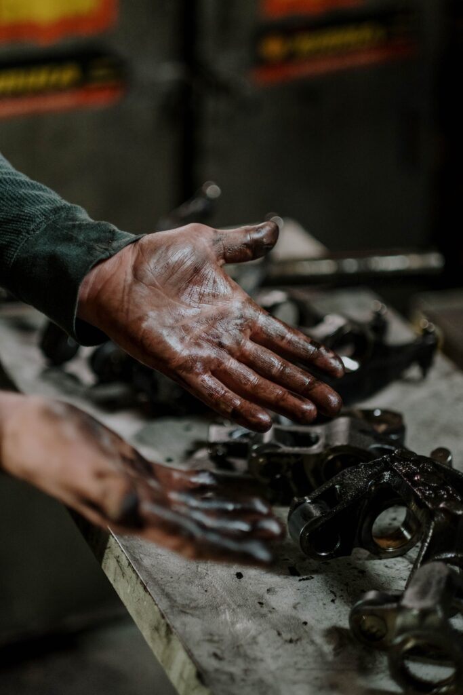

Vor einem halben Jahr habe ich ein Mandat (60%) bei einem Kunden starten dürfen. Als frisch gebackener Selbständiger ein Erfolg und gleichzeitig eine Herausforderung dem gewachsen zu sein, was auf mich zukommt.

## Auftragsklärung

Bei der Auftragsklärung haben wir uns darüber unterhalten, was wir alles erreichen wollen. Im R&D wollen wir schneller und effizienter werden. Gleichzeitig soll die Vorhersagbarkeit und Zuverlässigkeit verbessert werden. Das Projektmanagement soll analysiert und verbessert werden, mit möglichst automatisierten Prozessen. Und noch anderes mehr…

Eine rechte Packung für ein vorgesehenes halbes Jahr und das als einziger Agile Coach.

Mit all dem was auf dem Tisch lag, war es schwierig, sich zu entscheiden, wo man anfängt. Ich habe mich auf meine Intuition verlassen und auf verschiedenen Ebenen angefangen.

## Tätigkeiten

Strategisch legte ich mich auf das Flight Levels Modell fest. Langfristig soll die Arbeit durch ein stabiles System fliessen können, damit wir daran auch kontinuierlich verbessern und adaptieren können. Das bedeutete einige Analysen der IST Situation und Aufzeigen von möglichen Ansätzen. Dazu habe ich immer wieder punktuell die Stakeholder abgeholt, damit sie im Loop bleiben und die Veränderung mittragen können.

Das Unternehmen wächst aus seinem Startup Charakter heraus. Die Zeiten von jeder kann alles und weiss alles ist vorbei. Es haben sich spezialisierte Teams gebildet. Die Koordination ist eine Herausforderung und den Fokus zu halten ebenfalls. Oft ist nicht klar, wer jetzt genau warum an was arbeitet. Viele neue Ideen führen zu noch mehr gestarteter Arbeit und wegen Abhängigkeiten von Zulieferung und Kundenfeedbacks ist ein Abschließen von Arbeit oft eine Herausforderung.

Hier haben wir uns mit unterschiedlichen Koordinations-Boards geholfen. Auf Ebene Teams, um die unmittelbaren Tätigkeiten in Status und Menge transparent zu machen. Und auf Projektebene sollte auch transparent hervorgebracht werden, was alles auf dem Tisch der R&D Abteilung ist.

Während dieser Analysen sind mir immer wieder kleine Sachen begegnet, die ich sofort korrigieren wollte. Kleine Prozessverbesserungen und Automatisierungen. Andere Teams für das Kollaborations-Tool überzeugt und die Möglichkeiten aufgezeigt. Wer sich jemals mit Jira Automatisierungen rumgeschlagen hat, kann den Titel dieses Blogs sicher gut nachvollziehen. Es ist Knochenarbeit, mit den Einschränkungen des Tools zu leben und die Komplexität der vorhandenen Standardprozesse zu berücksichtigen. Zudem trat man in unterschiedlichen Gärtchen und man musste die Menschen für Veränderung gewinnen.

Die Skepsis von Veränderungen schlug einem fast täglich ins Gesicht. Mit guten Argumenten und durchdachten Lösungen konnten auch nicht R&D Teams für Veränderung gewonnen werden.

Für ein Team durfte ich dann auch noch etwas Zeit für deren Teamentwicklung beisteuern. Es ist eine Knacknuss die sieben fachlich sehr kompetenten Ingenieuren, verteilt über die Welt, für Veränderung zu gewinnen. Eine Kultur, die der OpenSource Community sehr ähnlich ist. Individualität und fachliche Kompetenz werden sehr hoch bewertet. Modelle von intensiver Zusammenarbeit, gemeinsamen Zielen und Teamgeist sind eher weniger gefragt. Hier einen Weg zu finden, die Arbeit für alle optimal zu gestalten, ist immer noch eine Herausforderung und es wird spannend, wohin der Weg uns führen wird.

## Wie so dieser Titel?

Als ich gestartet bin, hätte ich nicht gedacht, wie tief ich in die Materie und Details eintauchen muss, um Erfolg zu haben. Meine Vorstellung war, ich werde mit internen Menschen zusammen den Change vorantreiben. Jeder ist sehr hilfsbereit und ich kriege die Informationen die ich brauche und sie sind auch sehr mit ihrer Arbeit beschäftigt. Ein Ausdruck von, nein ich kann nun nicht auch noch Veränderungen vornehmen, ich überblicke sonst doch kaum das Chaos.

Mit diesen Umständen muss man umgehen können und selber die Arbeit tun. Sich die Hände an Jira Automation oder Retrospektiven “dreckig” machen. 

Ich bin wirklich froh um dieses Engagement, welches mir ermöglicht, nach meinen Prinzipien zu arbeiten. Pragmatisch, Praktisch und Professionell. Ich bin mir nicht zu schade, die anstehende Arbeit entgegenzunehmen, auch wenn es am Anfang nicht so definiert wurde. Ich versuche dem Kunden zu dienen, dabei auch aufzuzeigen und transparent zu machen, wo meine Grenzen sind.

(Foto von cottonbro studio: https://www.pexels.com/de-de/foto/mann-person-hande-dreckig-7568424/)

## Und was ist mit den Zielen?

Die haben wir nicht aus den Augen verloren. Aktuell sind wir daran, die strategische Ebene technisch in Jira zu überführen. Somit wird Transparenz von der Strategie bis zum Task in dem Team möglich. Wir sind dann soweit, dass wir einen Teil von R&D mit allen Ebenen von Boards ausgestattet haben und anfangen können zu reflektieren und verbessern. Ich bin fest davon überzeugt, dass die Stabilisierung des Arbeitsablaufs zu mehr Geschwindigkeit führen kann und damit wäre dann auch das Projektmanagement entlastet oder inexistent, weil es über die Boards mit den dazugehörigen agilen Interaktionen selbst-geführt ist.

Ein großer Gewinn war, dass nun Change nicht mehr nur Böse ist. Mit den vielen kleinen Verbesserungen konnten wir beweisen, dass es gewinnbringend sein kann. Nicht immer sind die großen Würfe entscheidend.

## Wie geht es weiter?

Aktuell läuft mein Mandat noch und wir sind bei weitem noch nicht am Ziel, welches wir erreichen wollten. Ich bin gespannt, wie der Kunde mit mir weiterarbeiten will.

Wenn du mit jemandem wie mir gerne so zusammenarbeiten freue ich mich sehr auf deine Kontaktaufnahme.

Januar 2023, Agilist, Manuel Müller
