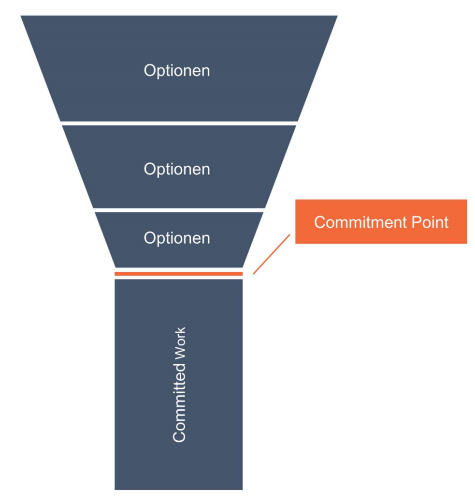

**As a Scrum Master and Agile Coach one had also have to have some know how in other methodologies like Kanban. This know how can give you another sight on your team but to be on the Kanban dictionary on the work. Because Kanban is focusing on work and the respective flow through an organization.**

I very enjoyed the physically training with wertwandler.ch taking place at 02. to 03.09.2021 in Bern, Switzerland. We were a group from very different locations and all of them were very experienced in their fields so we had good and deep discussion together.

What did I take with me?

First, this was a Kanban System Improvement certification course from the Kanban University. The learnings objectives are clear and given by KU but it also depends on the trainer and the attendees to make such a course even more valuable.

The first aha moment I had is, as trivial it sounds, from the design from the Kanban board. Not only working with limiting the work (WIP limit) in progress but also the work type (horizontal). With the work type one can steer on which type you want to invest. For example you always want 20% invest in support and improvements, or at least 50% in change request. Another interesting point was that you can also work with a minimum WIP, to make sure that for example that the team always work on existing bugs.

What I really like at the Kanban approach is, it starts not with implementing a huge change project and introduction into different frameworks. Kanban = "start were you are". Understand how the actual processes are documented and how they are really lived. Take consider to the actual roles and responsibilities. Then after the permission to proceed, start with visualizing the actual work and work from this point.

What I didn't recognize until this course that Kanban has an Maturity Model (KMM) which helps to ordering the organizational maturity and supports to do the right Kanban implements in the right moment. It is of very much use to pick the right practices in the right moment. One of the key notes I took was, that 80% of the organization are on level 0 to 1.

We explored the KMM with real world examples from the participants. With this we could dive into the Maturity Model and identify typical challenges like where to define the service borders, what are the system borders, scaling discussions. To had insights into other organizations and their challenges is always a big learning point. Somehow similar to the own challenges at the other hand totally different context.

During this two days it becomes clear that Kanban manages the flow of work and try to optimize it. In opposite to Scrum where we try to explore our product to find the maximum value, Kanban focus on deliver the work items with an optimal flow through the organization. In my perspective the Kanban works really well in the complicated domain (cynefin, dave snowden).

Kanban addresses the complex problem more in the discovery phase, which takes place before the delivery. The discovery phase exists of a funnel with different decision points, would we proceed or not. At the end of the funnel is a commitment point, where the organizations commits to deliver the defined work items.

The Service Request Manager is responsible to find the best option for next deliveries, the Service Delivery Manager's accountability is to optimize the flow of work after the commitment point.

There are different cadencies (aka ceremonies in Scrum) to organize the work with the team. Service Delivery focuses on the "What we are going to deliver next?" and "How we can optimize the work?". The Service Improvements are here to inspect and adapt the quality, checking the upcoming risks underlined with data from the process. This two cadencies are used as feedback loop and continuous improvement.

If the organization is moving up in the KMM more cadencies are recommended, for example the

A really good value of Kanban lays in the metrics that come along with it. Lead time and flow efficiency are only two
