[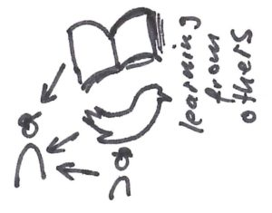](https://www.agilistic.ch/wp-content/uploads/2017/10/ScrumMasterThatMatters_Community_LearningFromOthers-1.jpg)

  

[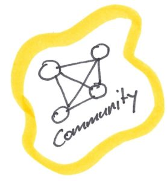](https://www.agilistic.ch/wp-content/uploads/2017/10/ScrumMasterThatMatters_Community-1.jpg)

  

  

[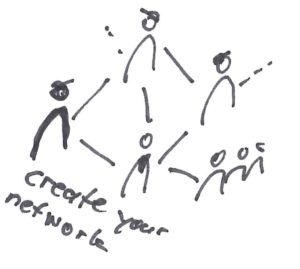](https://www.agilistic.ch/wp-content/uploads/2017/10/ScrumMasterThatMatters_Community_CreateYourNetwork-1.jpg)

  

  

[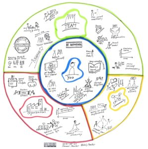](https://www.agilistic.ch/wp-content/uploads/2017/10/ScrumMasterThatMatters_Original_DoppeltMakeYourselfUnneccesary-1.jpeg)

  

  

[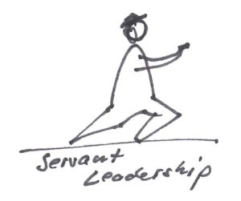](https://www.agilistic.ch/wp-content/uploads/2017/10/ScrumMasterThatMatters_Organization_ServantLeadership-1.jpg)

  

[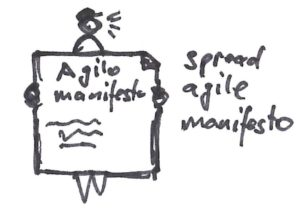](https://www.agilistic.ch/wp-content/uploads/2017/10/ScrumMasterThatMatters_Organization_AgileManifesto-1.jpg)

  

  

  

[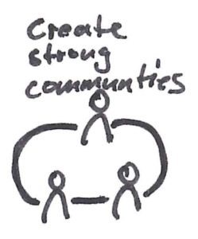](https://www.agilistic.ch/wp-content/uploads/2017/10/ScrumMasterThatMatters_Organization_CreateStrongCommunities-1.jpg)

  

[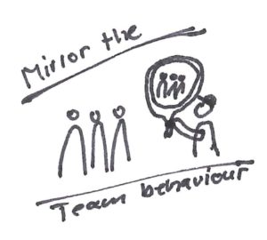](https://www.agilistic.ch/wp-content/uploads/2017/10/ScrumMasterThatMatters_Team_MirrorTeamBehaviour-1.jpg)

  

  

  

[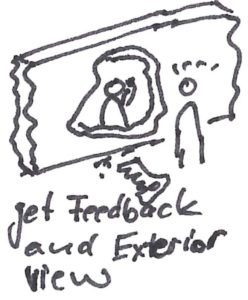](https://www.agilistic.ch/wp-content/uploads/2017/10/ScrumMasterThatMatters_You_GetFeedbackAndExteriorView-1.jpg)

  

  

[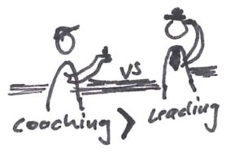](https://www.agilistic.ch/wp-content/uploads/2017/10/ScrumMasterThatMatters_Team_CoachingVsLeading-1.jpg)

  

  

  

[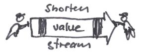](https://www.agilistic.ch/wp-content/uploads/2017/10/ScrumMasterThatMatters_Organization_ShortenValueStream-1.jpg)

  

  

[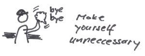](https://www.agilistic.ch/wp-content/uploads/2017/10/ScrumMasterThatMatters_Team_MakeYourselfUnnecessary_2-1.jpg)

  

[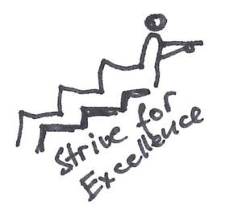](https://www.agilistic.ch/wp-content/uploads/2017/10/ScrumMasterThatMatters_You_StriveForExcellence-1.jpg)

  

[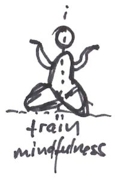](https://www.agilistic.ch/wp-content/uploads/2017/10/ScrumMasterThatMatters_You_TrainMindfulness-1.jpg)

  

[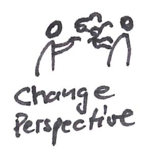](https://www.agilistic.ch/wp-content/uploads/2017/10/ScrumMasterThatMatters_You_ChangePerspective-1.jpg)

  

[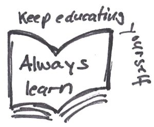](https://www.agilistic.ch/wp-content/uploads/2017/10/ScrumMasterThatMatters_You_KeepEducatingYourself-1.jpg)

  

[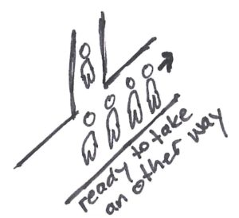](https://www.agilistic.ch/wp-content/uploads/2017/10/ScrumMasterThatMatters_You_ReadyToTakeAnotherWay-1.jpg)

  

[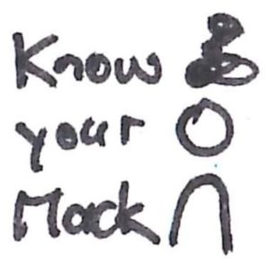](https://www.agilistic.ch/wp-content/uploads/2017/10/ScrumMasterThatMatters_You_KnowYourMacks-1.jpg)

  

[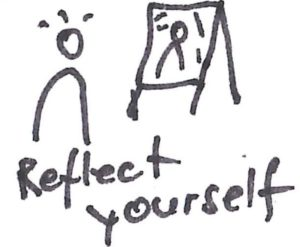](https://www.agilistic.ch/wp-content/uploads/2017/10/ScrumMasterThatMatters_You_ReflectYourself-1.jpg)

  

  

  

  

[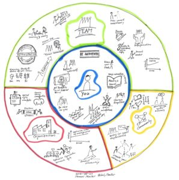](https://www.agilistic.ch/wp-content/uploads/2017/10/ScrumMasterThatMatters-1.jpg)

  

  

[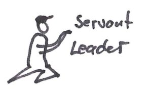](https://www.agilistic.ch/wp-content/uploads/2017/10/ScrumMasterThatMatters_Team_ServantLeader-1.jpg)

  

  

[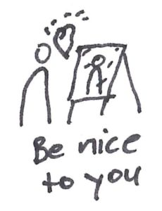](https://www.agilistic.ch/wp-content/uploads/2017/10/ScrumMasterThatMatters_You_BeNiceToYou-1.jpg)

  

