[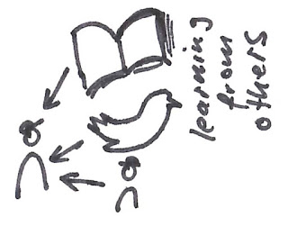](https://1.bp.blogspot.com/-_xmZFqWE3Gw/Wd7xstT8aEI/AAAAAAAAQds/UuS0371tE-ofHjDR9Ov7QcVdERuLy8ylwCKgBGAs/s1600/ScrumMasterThatMatters_Community_LearningFromOthers.jpg)

  

[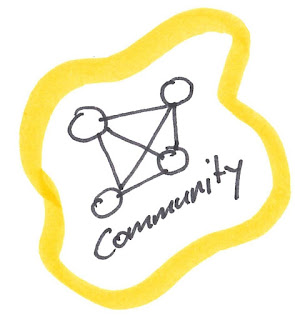](https://3.bp.blogspot.com/-RGrlUA3p_P0/Wd7xshG0nBI/AAAAAAAAQds/LL2NPUJGKzcIRv97y9jF68_zCtDN_R0DgCKgBGAs/s1600/ScrumMasterThatMatters_Community.jpg)

  

[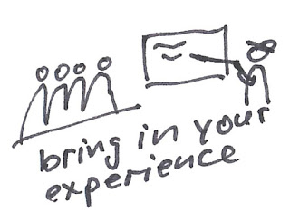](https://4.bp.blogspot.com/-U5WS60xflso/Wd7xspl4u7I/AAAAAAAAQds/2g1tILGwsDM8J07o1klV7N3H9F7xNLliACKgBGAs/s1600/ScrumMasterThatMatters_Community_BringInYourExperience.jpg)

  

[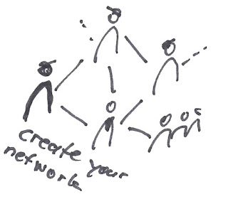](https://1.bp.blogspot.com/-bgtP1W5S4so/Wd7xsvL7yxI/AAAAAAAAQds/gAwThM0m4ysxD-6eEFHKnTtwT6FQlqp3ACKgBGAs/s1600/ScrumMasterThatMatters_Community_CreateYourNetwork.jpg)

  

  

[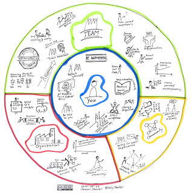](https://1.bp.blogspot.com/-yudlF_1-2ug/Wd7xsni9IuI/AAAAAAAAQds/JNHcFpSDDNw3THYHgwVAxJLmsefWcJqdACKgBGAs/s1600/ScrumMasterThatMatters_Original_DoppeltMakeYourselfUnneccesary.jpeg)

  

[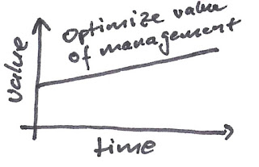](https://1.bp.blogspot.com/-DFKOAbS9GW0/Wd7xsjXWtBI/AAAAAAAAQds/jk6Cm0dqv4IWIT9-gkjSA6WbpvWl-Rp3QCKgBGAs/s1600/ScrumMasterThatMatters_Organization_OptimizeValueOfManagement.jpg)

  

[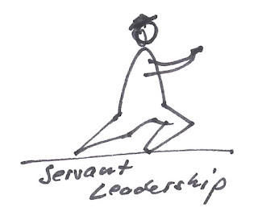](https://2.bp.blogspot.com/-fTjJsv8oVkQ/Wd7xsoZCJVI/AAAAAAAAQds/Fxr5vsCpuHsSDHrUnTYwPJLEDRkZOP6JACKgBGAs/s1600/ScrumMasterThatMatters_Organization_ServantLeadership.jpg)

  

[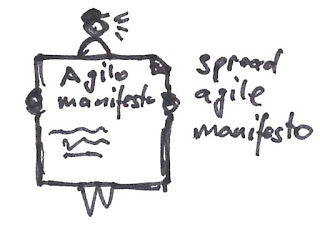](https://4.bp.blogspot.com/-pcfqluOfxwI/Wd7xsjeNZ4I/AAAAAAAAQds/wP3vAakh1IAtjP2hA2xkNoMgj7w0RJ2hwCKgBGAs/s1600/ScrumMasterThatMatters_Organization_AgileManifesto.jpg)

  

[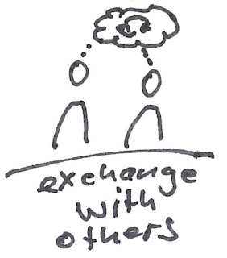](https://1.bp.blogspot.com/-ML4WCzynHXk/Wd7xsqrOiCI/AAAAAAAAQds/35wezsMf7ToWV48eajLgWMrB0Z3hdI3WwCKgBGAs/s1600/ScrumMasterThatMatters_Community_ExchangeWithOthers.jpg)

  

[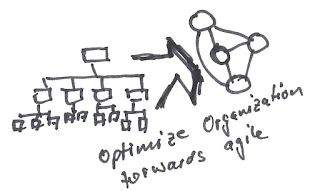](https://4.bp.blogspot.com/-M55NR1MAPK8/Wd7xsjD6Q-I/AAAAAAAAQds/gIb1iF_kUc4Oot8NYEWWxKPAjw8KbMJBwCKgBGAs/s1600/ScrumMasterThatMatters_Organization_OptimizeOrganizationTorwardsAgile.jpg)

  

[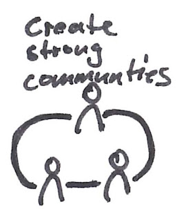](https://3.bp.blogspot.com/-5IqjayW_4b4/Wd7xshGtsiI/AAAAAAAAQds/TIzwU2XlJislPVELdjHJ4Q73adzTbvp3gCKgBGAs/s1600/ScrumMasterThatMatters_Organization_CreateStrongCommunities.jpg)

  

[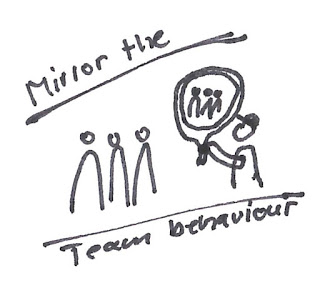](https://2.bp.blogspot.com/-v7Bkr77trnA/Wd7xsrNtuqI/AAAAAAAAQds/f7WzSlg63_8wnn0yPsUb9xxiR5KgFtDmACKgBGAs/s1600/ScrumMasterThatMatters_Team_MirrorTeamBehaviour.jpg)

  

[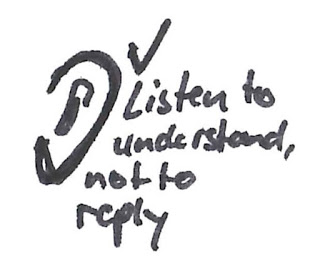](https://2.bp.blogspot.com/-eOjW5WGHUhk/Wd7xsqHKSXI/AAAAAAAAQds/pnI9MnXrnacDPxxhAjPkIR3IxpzoukXPQCKgBGAs/s1600/ScrumMasterThatMatters_Team_ListenToUnderstandNotToReply.jpg)

  

[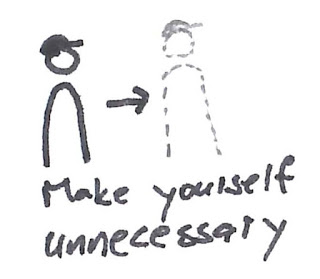](https://1.bp.blogspot.com/-7-clvOaf30A/Wd7xsq-jVSI/AAAAAAAAQds/ZwtQPDnJdp01_8HMjl2-Vvc8Di4FKELrwCKgBGAs/s1600/ScrumMasterThatMatters_Team_MakeYourselfUnnecessary.jpg)

  

[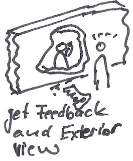](https://3.bp.blogspot.com/-0UAvqZx5Mww/Wd7xsvW5SSI/AAAAAAAAQds/MsnC5q3d-ZQ1Vc-uIpSSiJkt-qB3NykCACKgBGAs/s1600/ScrumMasterThatMatters_You_GetFeedbackAndExteriorView.jpg)

  

[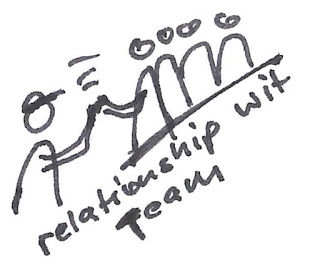](https://1.bp.blogspot.com/-0vN7he1iaiA/Wd7xssjPt0I/AAAAAAAAQds/nyxLjD7oWnou4Jsii4Kvv6AoWQOhK36awCKgBGAs/s1600/ScrumMasterThatMatters_Team_CreateRelationshipWithTeam.jpg)

  

[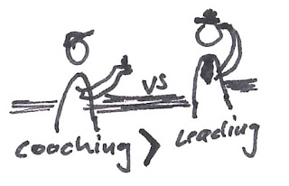](https://3.bp.blogspot.com/-GnheT8nPq6g/Wd7xslMwRRI/AAAAAAAAQds/Q6iV4T2moXMeVmFWw2BGVfb75ohDfWEMgCKgBGAs/s1600/ScrumMasterThatMatters_Team_CoachingVsLeading.jpg)

  

[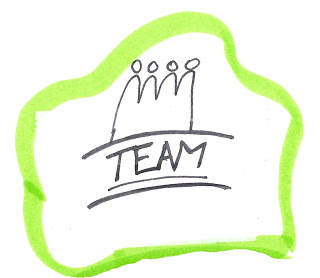](https://1.bp.blogspot.com/-vkHpsCjNlzk/Wd7xsra8COI/AAAAAAAAQds/OM9Tz5F6q_EowdgBVGiHO_tCVh8ZCPr7ACKgBGAs/s1600/ScrumMasterThatMatters_Team.jpg)

  

[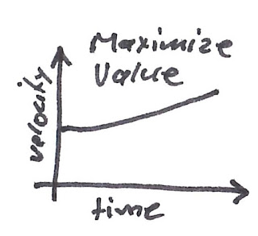](https://1.bp.blogspot.com/-r92VbtSPeVE/Wd7xstJsuuI/AAAAAAAAQds/Vd6d9Q_olkMq6wxtjF8RiBeOjct4S86fgCKgBGAs/s1600/ScrumMasterThatMatters_Team_MaximizeValue.jpg)

  

[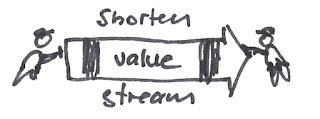](https://2.bp.blogspot.com/-EBb-AD_oW-E/Wd7xsn1EEoI/AAAAAAAAQds/_-zqFn63D8oB3a3Yr6U3KK2sGEtAyqZOQCKgBGAs/s1600/ScrumMasterThatMatters_Organization_ShortenValueStream.jpg)

  

[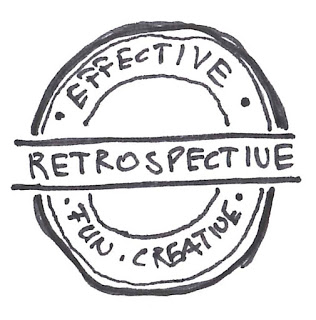](https://3.bp.blogspot.com/-rMs2eHo3qLQ/Wd7xslo9I8I/AAAAAAAAQds/SwfmeCKmJ1Iuy-eHG4wbm9Yd0J2tUi3VQCKgBGAs/s1600/ScrumMasterThatMatters_Team_EffectiveRetrospective.jpg)

  

[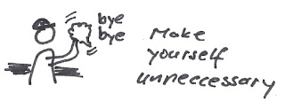](https://2.bp.blogspot.com/-4g0zqt0Cu_M/Wd7xslvEkhI/AAAAAAAAQds/aV3GLFP7jLQBg1XINZIfEXKW1bpj6RCxgCKgBGAs/s1600/ScrumMasterThatMatters_Team_MakeYourselfUnnecessary_2.jpg)

  

[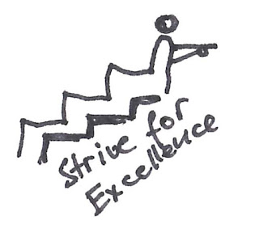](https://2.bp.blogspot.com/-e2WEDqsfobE/Wd7xsqQTQzI/AAAAAAAAQds/LbrnGQzWi-k12nYUpQNxuAL9QOgBn4BzwCKgBGAs/s1600/ScrumMasterThatMatters_You_StriveForExcellence.jpg)

  

[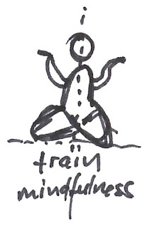](https://3.bp.blogspot.com/-WaNdFpyHlqw/Wd7xsvG5NfI/AAAAAAAAQds/R75NtbNKoEMEEE2wQMbr6Ar4J_R1ScEnwCKgBGAs/s1600/ScrumMasterThatMatters_You_TrainMindfulness.jpg)

  

[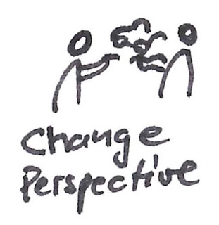](https://4.bp.blogspot.com/-SAdFyy-uBZM/Wd7xsh_P0GI/AAAAAAAAQds/dPUV32HqkB0UZAIKlOBfzTM9ear8jah1gCKgBGAs/s1600/ScrumMasterThatMatters_You_ChangePerspective.jpg)

  

[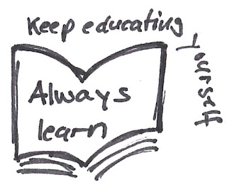](https://3.bp.blogspot.com/-41C1YCzsojI/Wd7xsoGqloI/AAAAAAAAQds/KMvB0jvyYmIcIvT8tQQtXIoq_wCQyjmvwCKgBGAs/s1600/ScrumMasterThatMatters_You_KeepEducatingYourself.jpg)

  

[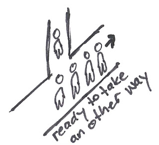](https://4.bp.blogspot.com/-nWccE-JYj3E/Wd7xsuaXEDI/AAAAAAAAQds/3co1YSd1jNAqQ1a2PgrJ_IZddVnY5NzOACKgBGAs/s1600/ScrumMasterThatMatters_You_ReadyToTakeAnotherWay.jpg)

  

[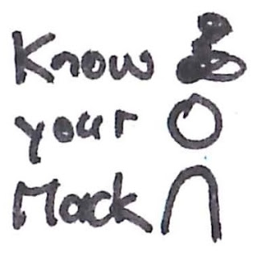](https://1.bp.blogspot.com/-k2C4fZy6LzY/Wd7xsmIYhsI/AAAAAAAAQds/ggbzrKd5DAoDPDCqIrkg5OXVg-v_0ifewCKgBGAs/s1600/ScrumMasterThatMatters_You_KnowYourMacks.jpg)

  

[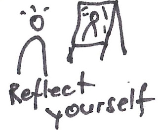](https://3.bp.blogspot.com/-4nTlR37Lr7I/Wd7xsohmW8I/AAAAAAAAQds/ZWybYTP1kLwj1imdhOUlXuUrUdIUgjyBgCKgBGAs/s1600/ScrumMasterThatMatters_You_ReflectYourself.jpg)

  

[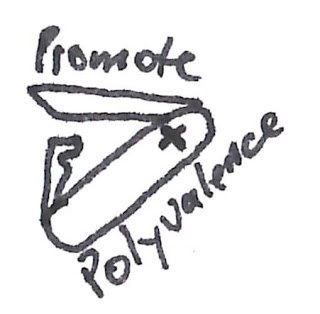](https://4.bp.blogspot.com/-54tqNKsurkk/Wd7xsn-3VhI/AAAAAAAAQds/RDY4YbytkGA7fLvGLE1myzZQrBW3ENr5gCKgBGAs/s1600/ScrumMasterThatMatters_Team_PromotePolyvalence.jpg)

  

  

[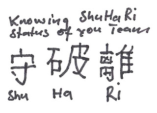](https://4.bp.blogspot.com/-JC14GwHq6eE/Wd7xsklImlI/AAAAAAAAQds/JHLsojwWA4sNtMDpXWErJ2vJpkaPqMWtQCKgBGAs/s1600/ScrumMasterThatMatters_Team_ShuHaRi.jpg)

  

[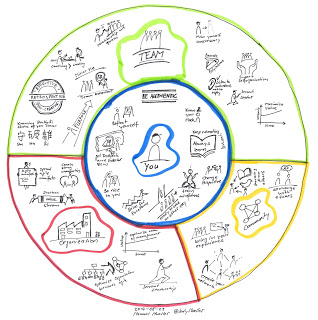](https://3.bp.blogspot.com/-OcI9KnyT-Z8/Wd7xsr6C7TI/AAAAAAAAQds/XYjhVhTEI1s_dfU6RA9owdnRkFj-WyzLwCKgBGAs/s1600/ScrumMasterThatMatters.jpg)

  

[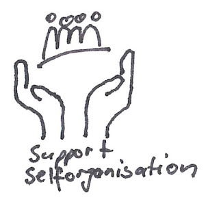](https://4.bp.blogspot.com/-feiFuS03VKs/Wd7xsv_CDgI/AAAAAAAAQds/cGpNMv-u4zQ4OIJeejuHHLkIprx-qfcYwCKgBGAs/s1600/ScrumMasterThatMatters_Team_SupportSelforganisation.jpg)

  

[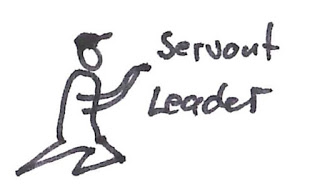](https://4.bp.blogspot.com/-GAPpxLHAGlU/Wd7xssnmYVI/AAAAAAAAQds/KCqh1mB6cc4a9Hlgh6jABUREtp9xAHGrgCKgBGAs/s1600/ScrumMasterThatMatters_Team_ServantLeader.jpg)

  

[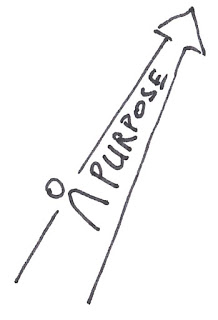](https://4.bp.blogspot.com/-4Kin-kjtmT0/Wd7xsoixDRI/AAAAAAAAQds/PzlktlwFfbYsWEd3a6UXjWroDzYrfDrugCKgBGAs/s1600/ScrumMasterThatMatters_Team_Purpose.jpg)

  

[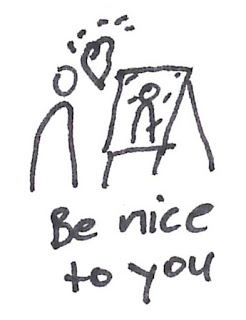](https://1.bp.blogspot.com/-Wfp_i3lqn-8/Wd7xsn1TXqI/AAAAAAAAQds/F41L6n6TtZ0rCJYm9qra5vdVxKW6PAC1gCKgBGAs/s1600/ScrumMasterThatMatters_You_BeNiceToYou.jpg)

  

[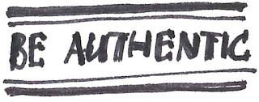](https://3.bp.blogspot.com/-AzHxse9tqJw/Wd7xsh_RKzI/AAAAAAAAQds/yoQ2dJkz6w0NIoLAFnwBIoK8JEEJJuD8ACKgBGAs/s1600/ScrumMasterThatMatters_You_BeAuthentic.jpg)
